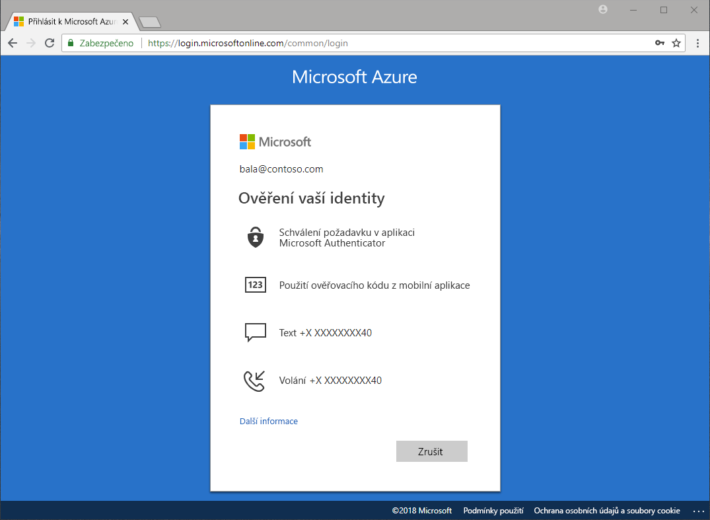

# Které metody ověřování jsou dostupné?

Občas můžete slyšet ve zprávách, jak někdo ukradne hesla nebo dojde k ohrožení zabezpečení identit. Zabezpečení organizace můžete kromě běžného hesla okamžitě zvýšit vynucením dvoufaktorového ověřování. Microsoft Azure Active Directory (Azure AD) obsahuje funkce, jako je Azure Multi-Factor Authentication (Azure MFA) a samoobslužné resetování hesla Azure AD (SSPR), které s dalšími metodami ověřování pomáhají správcům chránit organizace a uživatele.

Existuje mnoho scénářů, které zahrnují: přihlášení k aplikaci, resetování hesla, povolení Windows Hello, společně s dalšími, uživatelé mohou požádáni o zadání dalšího ověření, že jsou kdo, Řekněme, že jsou.

Dodatečné ověřování může mít podobu jedné z těchto metod ověřování:

* kód v e-mailu nebo zprávě SMS
* telefonní hovor
* oznámení nebo kód v telefonu
* odpovědi na bezpečnostní otázky

Samoobslužné resetování hesla služby Azure MFA a Azure AD dává správcům kontrolu nad konfigurací, zásadami, monitorováním a vytvářením sestav ve službě Azure AD a na webu Azure Portal, aby mohli chránit své organizace.

## Samoobslužné resetování hesla

Samoobslužné resetování hesla dává uživatelům v případě potřeby možnost resetovat si heslo bez zásahu správce.

> [!VIDEO https://www.youtube.com/embed/hc97Yx5PJiM]

Samoobslužné resetování hesla zahrnuje:

* **Změna hesla:** Jsem vím svoje heslo, ale chcete ho změnit na něco nového.
* **Resetování hesla:** Mám nemůže přihlásit a chcete resetovat heslo pomocí metody jeden nebo více schválených ověřování.
* **Odemknutí účtu:** Nemůžu se přihlásit vzhledem k tomu, že je můj účet uzamčen a chcete odemknout pomocí jednoho nebo více schválených ověřovacích metod.

## Multi-Factor Authentication

Azure Multi-Factor Authentication (MFA) je řešení dvoustupňového ověřování od Microsoftu. Použitím metod ověřování schválených správcem pomáhá Azure MFA chránit přístup k datům a aplikacím a současně splňuje požadavky na jednoduchý proces přihlašování.

## Licenční požadavky

[!INCLUDE [Active Directory P1 license](../../../includes/active-directory-p1-license.md)]

## Další postup

Dalším krokem je začít a nakonfigurovat samoobslužné resetování hesla a ověřování Azure Multi-Factor Authentication.

Jak začít používat samoobslužné resetování hesla najdete v článku [Rychlé nasazení samoobslužného resetování hesla Azure AD](quickstart-sspr.md).

Další informace o samoobslužné resetování hesla ve článku [jak to funguje: Azure AD samoobslužné resetování hesla](concept-sspr-howitworks.md)

Další informace o ověřování Azure Multi-Factor Authentication v následujícím článku [jak to funguje: Azure Multi-Factor Authentication](concept-mfa-howitworks.md)
