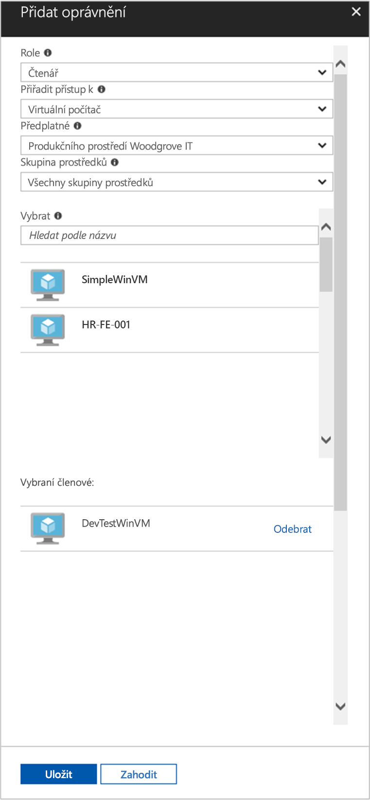

# <a name="use-a-windows-vm-system-assigned-managed-identity-to-access-resource-manager"></a>Použití spravované identity přiřazené systémem ve virtuálním počítači s Windows pro přístup k Resource Manageru

[!INCLUDE [preview-notice](../../../includes/active-directory-msi-preview-notice.md)]

V tomto rychlém startu se dozvíte, jak získat přístup k rozhraní API Azure Resource Manageru s využitím virtuálního počítače s Windows a povolenou spravovanou identitou přiřazenou systémem. Spravované identity pro prostředky Azure se spravují automaticky v Azure a umožňují vám ověřovat přístup ke službám podporujícím ověřování Azure AD bez nutnosti vložení přihlašovacích údajů do kódu. Získáte informace o těchto tématech:

> [!div class="checklist"] 
> * Udělení přístupu virtuálnímu počítači ke skupině prostředků v Azure Resource Manageru 
> * Získání přístupového tokenu pomocí identity virtuálního počítače a jeho použití k volání Azure Resource Manageru

## <a name="prerequisites"></a>Požadavky

[!INCLUDE [msi-tut-prereqs](../../../includes/active-directory-msi-tut-prereqs.md)]

## <a name="grant-your-vm-access-to-a-resource-group-in-resource-manager"></a>Udělení přístupu virtuálnímu počítači ke skupině prostředků v Resource Manageru
Když použijete spravované identity pro prostředky Azure, může kód získat přístupové tokeny sloužící k ověření přístupu k prostředkům, které podporují ověřování Azure AD.  Azure Resource Manager podporuje ověřování Azure AD.  Nejdříve potřebujeme udělit spravované identitě přiřazené systémem virtuálního počítače přístup k prostředku v Resource Manageru. V tomto případě se jedná o skupinu prostředků, do které patří virtuální počítač.  

1.  Přejděte ke kartě **Skupiny prostředků**. 
2.  Vyberte **skupinu prostředků**, kterou jste pro **virtuální počítač s Windows** vytvořili. 
3.  Na panelu vlevo přejděte na **Řízení přístupu (IAM)** . 
4.  Pak **přidejte přiřazení role** k novému přiřazení role pro **virtuální počítač s Windows**.  V poli **Role** zvolte **Čtenář**. 
5.  V dalším rozevíracím seznamu **Přiřadit přístup k** vyberte prostředek **Virtuální počítač**. 
6.  Potom zkontrolujte, že je v rozevíracím seznamu **Předplatné** uvedené správné předplatné. A ve **skupině prostředků** vyberte **Všechny skupiny prostředků**. 
7.  Nakonec **vyberte** v rozevíracím seznamu svůj virtuální počítač s Windows a klikněte na **Uložit**.

    

## <a name="get-an-access-token-using-the-vms-system-assigned-managed-identity-and-use-it-to-call-azure-resource-manager"></a>Získání přístupového tokenu pomocí spravované identity přiřazené systémem virtuálního počítače a jeho použití k volání Azure Resource Manageru 

V této části budete muset použít **PowerShell**.  Pokud **PowerShell** nemáte nainstalovaný, stáhněte si ho [odtud](https://docs.microsoft.com/powershell/azure/overview). 

1.  Na portálu přejděte na **Virtuální počítače**, přejděte na svůj virtuální počítač s Windows a v části **Přehled** klikněte na **Připojit**. 
2.  Zadejte své **uživatelské jméno** a **heslo**, které jste přidali při vytváření virtuálního počítače s Windows. 
3.  Teď, když jste vytvořili **připojení ke vzdálené ploše** virtuálního počítače, otevřete ve vzdálené relaci **PowerShell**. 
4.  Pomocí rutiny Invoke-WebRequest vytvořte požadavek na koncový bod místní spravované identity pro prostředky Azure, abyste získali přístupový token pro Azure Resource Manager.

    ```powershell
       $response = Invoke-WebRequest -Uri 'http://169.254.169.254/metadata/identity/oauth2/token?api-version=2018-02-01&resource=https://management.azure.com/' -Method GET -Headers @{Metadata="true"}
    ```
    
    > [!NOTE]
    > Hodnota parametru „resource“ musí přesně odpovídat hodnotě, kterou očekává Azure AD. Při použití ID prostředku Azure Resource Manageru musí být v identifikátoru URI koncové lomítko.
    
    V dalším kroku extrahujte úplnou odpověď, která je uložena jako formátovaný řetězec JSON (JavaScript Object Notation) v objektu $response. 
    
    ```powershell
    $content = $response.Content | ConvertFrom-Json
    ```
    Potom z odpovědi extrahujte přístupový token.
    
    ```powershell
    $ArmToken = $content.access_token
    ```
    
    Nakonec proveďte pomocí přístupového tokenu volání Azure Resource Manageru. V tomto příkladu používáme také rutinu Invoke-WebRequest k volání Azure Resource Manager a do autorizační hlavičky zahrňte přístupový token.
    
    ```powershell
    (Invoke-WebRequest -Uri https://management.azure.com/subscriptions/<SUBSCRIPTION ID>/resourceGroups/<RESOURCE GROUP>?api-version=2016-06-01 -Method GET -ContentType "application/json" -Headers @{ Authorization ="Bearer $ArmToken"}).content
    ```
    > [!NOTE] 
    > V adrese URL se rozlišují velká a malá písmena. Proto zkontrolujte, jestli používáte přesně stejná velká a malá písmena, jaká jste použili při pojmenování skupiny prostředků, a zkontrolujte také velké G ve výrazu „resourceGroup“.
        
    Následující příkaz vrátí podrobnosti o skupině prostředků:

    ```powershell
    {"id":"/subscriptions/98f51385-2edc-4b79-bed9-7718de4cb861/resourceGroups/DevTest","name":"DevTest","location":"westus","properties":{"provisioningState":"Succeeded"}}
    ```

## <a name="next-steps"></a>Další kroky

V tomto rychlém startu jste se dozvěděli, jak pomocí spravované identity přiřazené systémem získat přístup k rozhraní API Azure Resource Manageru.  Další informace o Azure Resource Manageru najdete tady:

> [!div class="nextstepaction"]
>[Azure Resource Manager](/azure/azure-resource-manager/resource-group-overview)

