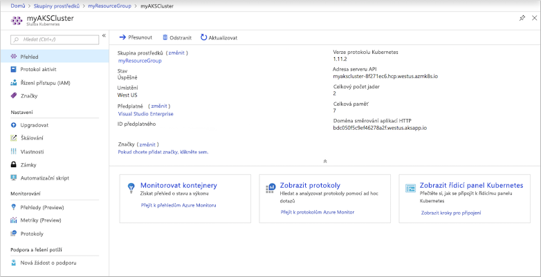
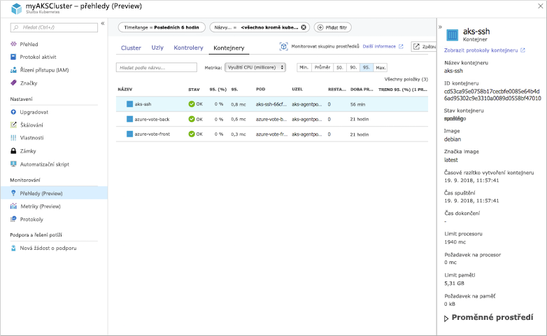

# <a name="quickstart-deploy-an-azure-kubernetes-service-aks-cluster-using-the-azure-portal"></a>Rychlý Start: nasazení clusteru služby Azure Kubernetes (AKS) pomocí Azure Portal

Služba Azure Kubernetes Service (AKS) je spravovaná služba Kubernetes, která umožňuje rychle nasadit a spravovat clustery. V tomto rychlém startu nasadíte cluster AKS pomocí portálu Azure. Aplikace s více kontejnery, která zahrnuje webový front-end a instanci Redis, se spouští v clusteru. Pak uvidíte, jak monitorovat stav clusteru a lusky, které spouští vaši aplikaci.


Tento rychlý start předpokládá základní znalosti konceptů Kubernetes. Další informace najdete v tématu [základní koncepty Kubernetes pro Azure Kubernetes Service (AKS)][kubernetes-concepts].

Pokud ještě předplatné Azure nemáte, vytvořte si napřed [bezplatný účet](https://azure.microsoft.com/free/?WT.mc_id=A261C142F).

## <a name="sign-in-to-azure"></a>Přihlášení k Azure

Přihlaste se k webu Azure Portal na adrese [https://portal.azure.com](https://portal.azure.com).

## <a name="create-an-aks-cluster"></a>Vytvoření clusteru AKS

Cluster AKS vytvoříte takto:

1. V nabídce webu Azure Portal nebo na **domovské stránce** vyberte **Create a resource** (Vytvořit prostředek).

2. Vyberte **Containers** (Kontejnery)  >   **Kubernetes Service**.

3. Na kartě **Basics** (Základy) nakonfigurujte následující možnosti:
    - **Podrobnosti o projektu**: vyberte **předplatné**Azure a pak vyberte nebo vytvořte **skupinu prostředků**Azure, například *myResourceGroup*.
    - **Podrobnosti o clusteru**: zadejte **název clusteru Kubernetes**, například *myAKSCluster*. Pro cluster AKS vyberte **Region** (Oblast), **Kubernetes version** (Verze Kubernetes) a **DNS name prefix** (Předpona názvu DNS).
    - **Fond primárních uzlů**: vyberte **Velikost uzlu** virtuálního počítače pro uzly AKS. Velikost virtuálního počítače se po nasazení clusteru AKS *nedá* změnit. 
            -Vyberte počet uzlů, které mají být do clusteru nasazeny. Pro účely tohoto rychlého startu nastavte **Počet uzlů** na hodnotu *1*. Počet uzlů *jde* upravit po nasazení clusteru.
    
    

    Po dokončení vyberte **Next: Scale** (Další: Škálovat).

4. Na stránce **škálování** ponechte výchozí možnosti. V dolní části obrazovky klikněte na **Další: ověřování**.
    > [!CAUTION]
    > Vytváření nových objektů služby AAD může trvat několik minut, než se rozšíří a stane se k dispozici, což způsobí, že se instanční objekt nenalezne chyby a chyby ověřování v Azure Portal. Pokud se [dostanete k tomuto](troubleshooting.md#received-an-error-saying-my-service-principal-wasnt-found-or-is-invalid-when-i-try-to-create-a-new-cluster) problému, navštivte prosím tento článek, abyste se mohli zmírnit.

5. Na kartě **Authentication** (Ověřování) nakonfigurujte následující možnosti:
    - Vytvořte nový instanční objekt tak, že v poli **Service Principal** (Instanční objekt) ponecháte možnost **(new) default service principal** ((nové) výchozí instanční objekt). Můžete také zvolit *Configure service principal* (Nakonfigurovat instanční objekt) a použít existující instanční objekt. Pokud použijete existující, budete muset zadat ID a tajný klíč klienta SPN.
    - U služby Kubernetes povolte možnost řízení přístupu na základě role (RBAC). Tím si zajistíte podrobnější kontrolu nad přístupem k prostředkům Kubernetes nasazeným v clusteru AKS.

    Alternativně můžete místo instančního objektu použít spravovanou identitu. Další informace najdete v tématu [použití spravovaných identit](use-managed-identity.md) .

Ve výchozím nastavení se používá *základní* sítě a Azure monitor pro kontejnery jsou povoleny. Klikněte na **Review + create** (Zkontrolovat a vytvořit) a po dokončení ověření na **Create** (Vytvořit).

Vytvoření clusteru AKS bude trvat několik minut. Po dokončení nasazení klikněte na **Přejít k prostředku**nebo přejděte do skupiny prostředků clusteru AKS, jako je třeba *myResourceGroup*, a vyberte prostředek AKS, jako je třeba *myAKSCluster*. Zobrazí se řídicí panel clusteru AKS, jako v tomto příkladu:



## <a name="connect-to-the-cluster"></a>Připojení ke clusteru

Ke správě clusteru Kubernetes použijete klienta příkazového řádku Kubernetes [kubectl][kubectl]. Klient `kubectl` je předinstalovaný ve službě Azure Cloud Shell.

Pomocí `>_` tlačítka v horní části Azure Portal otevřete Cloud Shell.


Pomocí příkazu [az aks get-credentials][az-aks-get-credentials] nakonfigurujte klienta `kubectl` pro připojení k vašemu clusteru Kubernetes. Tento příkaz stáhne pověření a nakonfiguruje rozhraní příkazového řádku Kubernetes pro jejich použití. Následující příklad získá přihlašovací údaje pro název clusteru *myAKSCluster* ve skupině prostředků *myResourceGroup*:

```azurecli
az aks get-credentials --resource-group myResourceGroup --name myAKSCluster
```

Pokud chcete ověřit připojení ke clusteru, použijte příkaz [kubectl get][kubectl-get], který vrátí seznam uzlů clusteru.

```console
kubectl get nodes
```

Následující příklad výstupu ukazuje jeden uzel vytvořený v předchozích krocích. Ujistěte se, že stav uzlu je *připravený*:

```output
NAME                       STATUS    ROLES     AGE       VERSION
aks-agentpool-14693408-0   Ready     agent     15m       v1.11.5
```

## <a name="run-the-application"></a>Spuštění aplikace

Soubor manifestu Kubernetes definuje požadovaný stav clusteru, například jaké image kontejnerů se mají spustit. V tomto rychlém startu manifest slouží k vytvoření všech objektů potřebných ke spuštění aplikace Azure Vote. Tento manifest obsahuje dvě [Kubernetes nasazení][kubernetes-deployment] – jeden pro ukázkové aplikace v Pythonu pro Azure a druhý pro instanci Redis. Vytvoří se také dvě [služby Kubernetes Services][kubernetes-service] – interní služba pro instanci Redis a externí služba pro přístup k aplikaci hlasování Azure z Internetu.

V Cloud Shell pomocí editoru vytvořte soubor s názvem `azure-vote.yaml` , například `code azure-vote.yaml` `nano azure-vote.yaml` nebo `vi azure-vote.yaml` . Pak zkopírujte následující definici YAML:

```yaml
apiVersion: apps/v1
kind: Deployment
metadata:
  name: azure-vote-back
spec:
  replicas: 1
  selector:
    matchLabels:
      app: azure-vote-back
  template:
    metadata:
      labels:
        app: azure-vote-back
    spec:
      nodeSelector:
        "beta.kubernetes.io/os": linux
      containers:
      - name: azure-vote-back
        image: mcr.microsoft.com/oss/bitnami/redis:6.0.8
        env:
        - name: ALLOW_EMPTY_PASSWORD
          value: "yes"
        resources:
          requests:
            cpu: 100m
            memory: 128Mi
          limits:
            cpu: 250m
            memory: 256Mi
        ports:
        - containerPort: 6379
          name: redis
---
apiVersion: v1
kind: Service
metadata:
  name: azure-vote-back
spec:
  ports:
  - port: 6379
  selector:
    app: azure-vote-back
---
apiVersion: apps/v1
kind: Deployment
metadata:
  name: azure-vote-front
spec:
  replicas: 1
  selector:
    matchLabels:
      app: azure-vote-front
  template:
    metadata:
      labels:
        app: azure-vote-front
    spec:
      nodeSelector:
        "beta.kubernetes.io/os": linux
      containers:
      - name: azure-vote-front
        image: mcr.microsoft.com/azuredocs/azure-vote-front:v1
        resources:
          requests:
            cpu: 100m
            memory: 128Mi
          limits:
            cpu: 250m
            memory: 256Mi
        ports:
        - containerPort: 80
        env:
        - name: REDIS
          value: "azure-vote-back"
---
apiVersion: v1
kind: Service
metadata:
  name: azure-vote-front
spec:
  type: LoadBalancer
  ports:
  - port: 80
  selector:
    app: azure-vote-front
```

Nasaďte aplikaci pomocí příkazu [kubectl Apply][kubectl-apply] a zadejte název manifestu YAML:

```console
kubectl apply -f azure-vote.yaml
```

Následující příklad výstupu ukazuje, že se nasazení a služby úspěšně vytvořily:

```output
deployment "azure-vote-back" created
service "azure-vote-back" created
deployment "azure-vote-front" created
service "azure-vote-front" created
```

## <a name="test-the-application"></a>Testování aplikace

Když je aplikace spuštěná, služba Kubernetes zpřístupňuje front-end aplikace na internetu. Dokončení tohoto procesu může trvat několik minut.

Pomocí příkazu [kubectl get service][kubectl-get] s argumentem `--watch` můžete sledovat průběh.

```console
kubectl get service azure-vote-front --watch
```

Zpočátku je *externí IP adresa* pro službu *Azure-hlas-front-end* zobrazená jako *nevyřízená*.

```output
NAME               TYPE           CLUSTER-IP   EXTERNAL-IP   PORT(S)        AGE
azure-vote-front   LoadBalancer   10.0.37.27   <pending>     80:30572/TCP   6s
```

Pokud se *IP* adresa změní z *čekání* na skutečnou veřejnou IP adresu, použijte `CTRL-C` k zastavení `kubectl` procesu sledování. Následující příklad výstupu ukazuje platnou veřejnou IP adresu přiřazenou ke službě:

```output
azure-vote-front   LoadBalancer   10.0.37.27   52.179.23.131   80:30572/TCP   2m
```

Pokud chcete zobrazit hlasovou aplikaci Azure v akci, otevřete webový prohlížeč na externí IP adresu vaší služby.


## <a name="monitor-health-and-logs"></a>Monitorování stavu a protokolů

Při vytváření clusteru byla povolena Azure Monitor pro kontejnery. Tato funkce monitorování poskytuje metriky stavu clusteru AKS i podů spuštěných na tomto clusteru.

Naplnění těchto dat na webu Azure Portal může trvat několik minut. Pokud chcete zobrazit aktuální stav, dobu provozu a využití prostředků pro pody Azure Vote, na webu Azure Portal přejděte zpět k prostředku AKS, například *myAKSCluster*. Přístup ke stavu potom získáte následujícím způsobem:

1. V části **monitorování** na levé straně vyberte **přehledy** .
1. V horní části zvolte **+ Přidat filtr**
1. Jako vlastnost vyberte *obor názvů* a pak zvolte *\<All but kube-system\>*
1. Vyberte zobrazení **Kontejnery**.

Zobrazí se kontejnery *azure-vote-back* a *azure-vote-front*, jak ukazuje následující příklad:



Pokud chcete zobrazit protokoly pro `azure-vote-front` pod, vyberte v rozevíracím seznamu kontejnery možnost **Zobrazit protokoly kontejnerů** . Tyto protokoly obsahují streamy výstupů *stdout* a *stderr* z kontejneru.


## <a name="delete-cluster"></a>Odstranění clusteru

Když už cluster nepotřebujete, odstraňte prostředek clusteru, čímž odstraníte všechny související prostředky. Tuto operaci můžete dokončit v Azure Portal tak, že na řídicím panelu clusteru AKS vyberete tlačítko **Odstranit** . Alternativně lze použít příkaz [AZ AKS Delete][az-aks-delete] v Cloud Shell:

```azurecli
az aks delete --resource-group myResourceGroup --name myAKSCluster --no-wait
```

> [!NOTE]
> Při odstranění clusteru se neodebere instanční objekt služby Azure Active Directory používaný clusterem AKS. Postup odebrání instančního objektu najdete v tématu věnovaném [aspektům instančního objektu AKS a jeho odstranění][sp-delete]. Pokud jste použili spravovanou identitu, tato identita je spravovaná platformou a nevyžaduje odebrání.

## <a name="get-the-code"></a>Získání kódu

V tomto rychlém startu se k vytvoření nasazení Kubernetes použily předem vytvořené image kontejneru. Související kód aplikace, soubor Dockerfile a soubor manifestu Kubernetes jsou k dispozici na GitHubu.

[https://github.com/Azure-Samples/azure-voting-app-redis][azure-vote-app]

## <a name="next-steps"></a>Další kroky

V tomto rychlém startu jste nasadili cluster Kubernetes a do něj jste nasadili vícekontejnerovou aplikaci.

Další informace o službě AKS a podrobné vysvětlení kompletního příkladu od kódu až po nasazení najdete v kurzu clusteru Kubernetes.

> [!div class="nextstepaction"]
> [Kurz AKS][aks-tutorial]

<!-- LINKS - external -->
[azure-vote-app]: https://github.com/Azure-Samples/azure-voting-app-redis.git
[kubectl]: https://kubernetes.io/docs/user-guide/kubectl/
[kubectl-apply]: https://kubernetes.io/docs/reference/generated/kubectl/kubectl-commands#apply
[kubectl-get]: https://kubernetes.io/docs/reference/generated/kubectl/kubectl-commands#get
[kubernetes-documentation]: https://kubernetes.io/docs/home/

<!-- LINKS - internal -->
[kubernetes-concepts]: concepts-clusters-workloads.md
[az-aks-get-credentials]: /cli/azure/aks?view=azure-cli-latest#az-aks-get-credentials
[az-aks-delete]: /cli/azure/aks#az-aks-delete
[aks-monitor]: ../azure-monitor/insights/container-insights-overview.md
[aks-network]: ./concepts-network.md
[aks-tutorial]: ./tutorial-kubernetes-prepare-app.md
[http-routing]: ./http-application-routing.md
[sp-delete]: kubernetes-service-principal.md#additional-considerations
[azure-dev-spaces]: ../dev-spaces/index.yml
[kubernetes-deployment]: concepts-clusters-workloads.md#deployments-and-yaml-manifests
[kubernetes-service]: concepts-network.md#services
