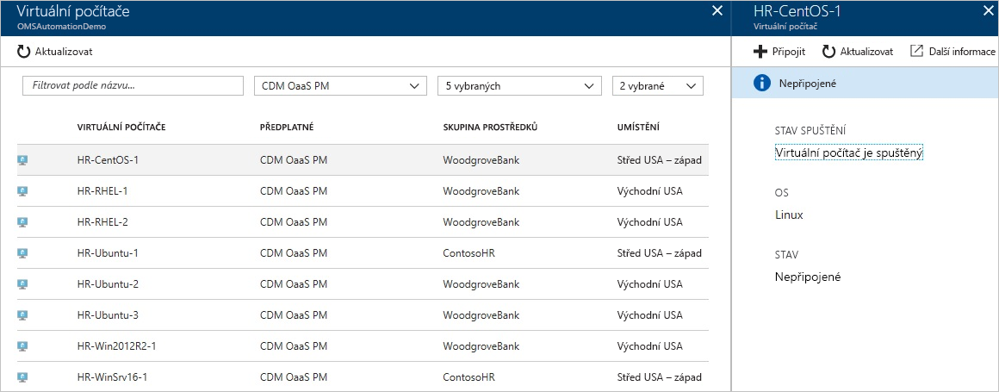
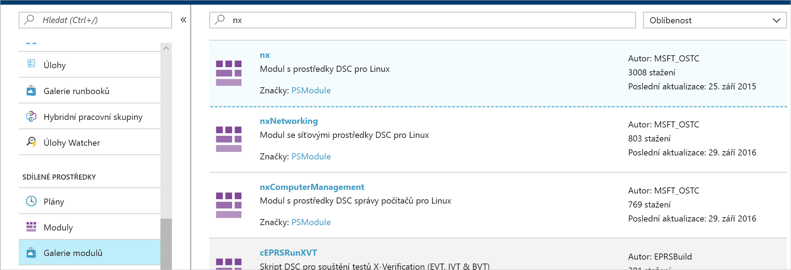

# <a name="configure-a-virtual-machine-with-desired-state-configuration"></a>Konfigurace virtuálního počítače s požadovanou konfigurací stavu

Povolením konfigurace požadovaného stavu (DSC) můžete spravovat a monitorovat konfigurace serverů s Windows a Linux. Konfigurace, které se posunou od požadované konfigurace, se dají identifikovat nebo automaticky opravit. Tento rychlý Start prochází kroky připojení virtuálního počítače se systémem Linux a nasazení zásobníku LAMP s DSC.

## <a name="prerequisites"></a>Požadované součásti

K dokončení tohoto rychlého startu potřebujete:

* Předplatné Azure. Pokud nemáte předplatné Azure, [Vytvořte si bezplatný účet](https://azure.microsoft.com/free/).
* Účet Azure Automation. Pokyny k vytvoření Azure Automation účtu Spustit jako najdete v tématu [účet Spustit](automation-sec-configure-azure-runas-account.md)jako pro Azure.
* Azure Resource Manager virtuální počítač (ne Classic) se spuštěným Red Hat Enterprise Linux, CentOS nebo Oracle Linux. Pokyny k vytvoření virtuálního počítače najdete v tématu [Vytvoření prvního virtuálního počítače se systémem Linux v Azure Portal](../virtual-machines/linux/quick-create-portal.md)

## <a name="sign-in-to-azure"></a>Přihlaste se k Azure
Přihlaste se k Azure na adrese https://portal.azure.com

## <a name="onboard-a-virtual-machine"></a>Zprovoznění virtuálního počítače
Existuje mnoho různých způsobů, jak připojit počítač a povolit konfiguraci požadovaného stavu. Tento rychlý Start popisuje připojování prostřednictvím účtu Automation. Další informace o různých metodách připojení počítačů k požadovaným stavům konfigurace najdete v článku [připojování](https://docs.microsoft.com/azure/automation/automation-dsc-onboarding) .

1. V levém podokně Azure Portal vyberte **účty Automation**. Pokud není zobrazený v levém podokně, klikněte na **všechny služby** a vyhledejte ho ve výsledném zobrazení.
1. V seznamu vyberte účet Automation.
1. V levém podokně účtu Automation vyberte **Konfigurace stavu (DSC)** .
2. Kliknutím na **Přidat** otevřete virtuální počítač vybrat stránku.
3. Vyhledejte virtuální počítač, pro který chcete povolit DSC. Konkrétní virtuální počítač můžete najít pomocí vyhledávacího pole a možností filtrování.
4. Klikněte na virtuální počítač a pak vyberte **připojit** .
5. Vyberte nastavení DSC, která jsou vhodná pro virtuální počítač. Pokud jste už připravili konfiguraci, můžete ji zadat jako *název konfigurace uzlu*. Můžete nastavit [režim konfigurace](https://docs.microsoft.com/powershell/scripting/dsc/managing-nodes/metaConfig) pro řízení chování konfigurace pro daný počítač.
6. Klikněte na **OK**.



I když je ve virtuálním počítači nasazené rozšíření pro konfiguraci požadovaného stavu, zobrazuje se *připojení.*

## <a name="import-modules"></a>Importovat moduly

Moduly obsahují prostředky DSC a mnoho najdete na [Galerie prostředí PowerShell](https://www.powershellgallery.com). Všechny prostředky, které se používají ve vašich konfiguracích, musí být před kompilací naimportovány do účtu Automation. Pro tento kurz je nutný modul s názvem **NX** .

1. V levém podokně účtu Automation vyberte **moduly Galerie** (v části sdílené prostředky).
1. Vyhledejte modul, který chcete importovat, zadáním části názvu: *NX*
1. Klikněte na modul, který chcete naimportovat.
1. Klikněte na **importovat** .



## <a name="import-the-configuration"></a>Import konfigurace

V tomto rychlém startu se používá konfigurace DSC, která na počítači konfiguruje server Apache HTTP, MySQL a PHP.

Informace o konfiguracích DSC najdete v tématu [Konfigurace DSC](https://docs.microsoft.com/powershell/scripting/dsc/configurations/configurations).

V textovém editoru zadejte následující příkaz a uložte ho místně jako `LAMPServer.ps1`.

```powershell-interactive
configuration LAMPServer {
   Import-DSCResource -module "nx"

   Node localhost {

        $requiredPackages = @("httpd","mod_ssl","php","php-mysql","mariadb","mariadb-server")
        $enabledServices = @("httpd","mariadb")

        #Ensure packages are installed
        ForEach ($package in $requiredPackages){
            nxPackage $Package{
                Ensure = "Present"
                Name = $Package
                PackageManager = "yum"
            }
        }

        #Ensure daemons are enabled
        ForEach ($service in $enabledServices){
            nxService $service{
                Enabled = $true
                Name = $service
                Controller = "SystemD"
                State = "running"
            }
        }
   }
}
```

Import konfigurace:

1. V levém podokně účtu Automation vyberte **Konfigurace stavu (DSC)** a pak klikněte na kartu **Konfigurace** .
2. Klikněte na **+ Přidat** .
3. Vyberte *konfigurační soubor* , který jste uložili v předchozím kroku.
4. Klikněte na **OK**.

## <a name="compile-a-configuration"></a>Kompilace konfigurace

Konfigurace DSC se musí před přiřazením k uzlu kompilovat do konfigurace uzlu (dokument MOF). Kompilace ověřuje konfiguraci a povoluje zadání hodnot parametrů. Další informace o kompilaci konfigurace naleznete v tématu: [kompilování konfigurací v Azure Automation DSC](https://docs.microsoft.com/azure/automation/automation-dsc-compile) .

Kompilace konfigurace:

1. V levém podokně účtu Automation vyberte **Konfigurace stavu (DSC)** a pak klikněte na kartu **Konfigurace** .
1. Vyberte konfiguraci, kterou jste importovali v předchozím kroku, "LAMPServer".
1. Z možností nabídky klikněte na **kompilovat** a pak na **Ano** .
1. V zobrazení konfigurace se zobrazí nová *úloha kompilace* zařazená do fronty. Po úspěšném dokončení úlohy budete připraveni přejít k dalšímu kroku. Pokud dojde k nějakým chybám, můžete kliknutím na úlohu kompilace zobrazit podrobnosti.

## <a name="assign-a-node-configuration"></a>Přiřazení konfigurace uzlu

Konfiguraci zkompilovaného *uzlu* je možné přiřadit uzlům DSC. Přiřazení aplikuje konfiguraci na počítač a monitoruje (nebo automaticky opravuje) jakoukoli odstavení z této konfigurace.

1. V levém podokně účtu Automation vyberte * * konfigurace stavu (DSC) a pak klikněte na kartu **uzly** .
1. Vyberte uzel, kterému chcete přiřadit konfiguraci.
1. Klikněte na **přiřadit konfiguraci uzlu** .
1. Vyberte *konfiguraci uzlu* - **LAMPServer. localhost** -k přiřazení a klikněte na **OK** .
1. Kompilovaná konfigurace je nyní přiřazena k uzlu a stav uzlu se změní na *čeká na vyřízení*. Při další periodické kontrole uzel načte konfiguraci, použije ho a nahlásí zpět stav. Může trvat až 30 minut, než uzel načte konfiguraci v závislosti na nastavení uzlu. Chcete-li vynutit okamžitou kontrolu, můžete spustit následující příkaz místně na virtuálním počítači se systémem Linux: `sudo /opt/microsoft/dsc/Scripts/PerformRequiredConfigurationChecks.py`


## <a name="viewing-node-status"></a>Zobrazení stavu uzlu

Stav všech spravovaných uzlů najdete v části **Konfigurace stavu (DSC)** a pak na kartě **uzly** v účtu Automation. Zobrazení můžete filtrovat podle stavu, konfigurace uzlu nebo hledání názvu.


## <a name="next-steps"></a>Další kroky

V tomto rychlém startu jste připojili virtuální počítač Linux k DSC, vytvořili konfiguraci pro sadu LAMP a nasadili jste ho do virtuálního počítače. Pokud chcete zjistit, jak můžete použít Automatizace DSC k povolení průběžného nasazování, pokračujte k článku:

> [!div class="nextstepaction"]
> [Průběžné nasazování do virtuálního počítače pomocí DSC a čokolády](./automation-dsc-cd-chocolatey.md)

* Další informace o konfiguraci požadovaného stavu PowerShellu najdete v tématu [Přehled konfigurace požadovaného stavu prostředí PowerShell](https://docs.microsoft.com/powershell/scripting/dsc/overview/overview).
* Další informace o správě Automatizace DSC z PowerShellu najdete v článku [Azure PowerShell](https://docs.microsoft.com/powershell/module/azurerm.automation/)
* Informace o předávání sestav DSC do Azure Monitor protokolů pro vytváření sestav a upozorňování najdete v tématu [předávání sestav DSC do protokolů Azure monitor](https://docs.microsoft.com/azure/automation/automation-dsc-diagnostics) . 

