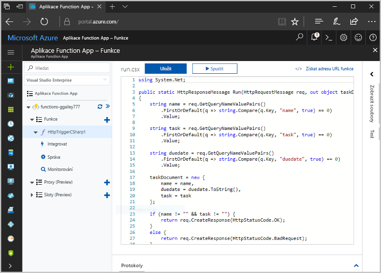
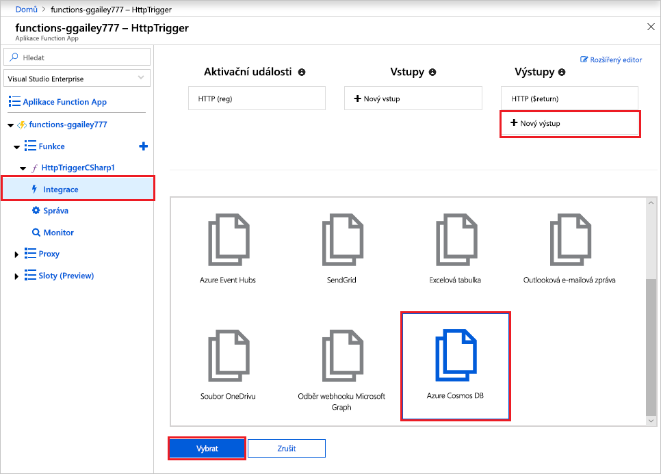
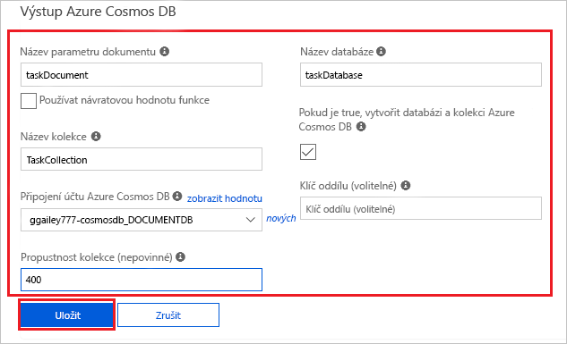
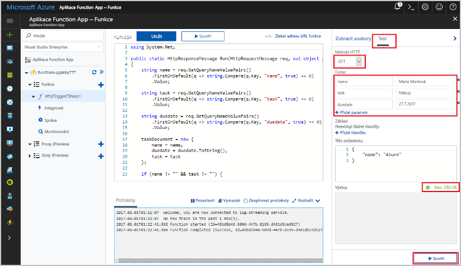
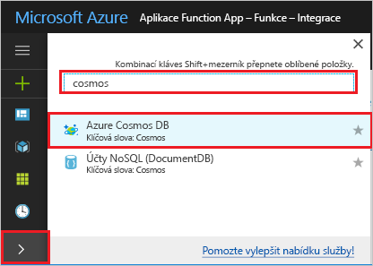
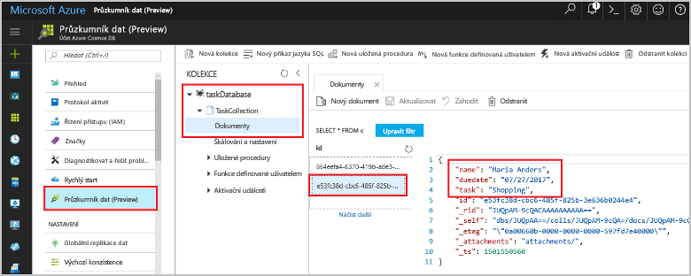

# <a name="store-unstructured-data-using-azure-functions-and-azure-cosmos-db"></a>Ukládání nestrukturovaných dat pomocí služeb Azure Functions a Azure Cosmos DB

[Azure Cosmos DB](https://azure.microsoft.com/services/cosmos-db/) nabízí skvělou možnost pro ukládání nestrukturovaných dat a dat JSON. Spolu s Azure Functions urychluje a zjednodušuje ukládání dat – ve srovnání s ukládáním dat v relační databáze budete potřebovat méně kódování.

> [!NOTE]
> V současnosti aktivační události Azure Cosmos DB a vstupní a výstupní vazby fungují jenom s účty SQL API a Graph API.

Ve službě Azure Functions poskytují vstupní a výstupní vazby deklarativní způsob připojení k datům externí služby z funkce. V tomto článku se dozvíte, jak aktualizovat stávající funkci a přidat výstupní vazbu, která ukládá nestrukturovaná data v dokumentu Azure Cosmos DB.



## <a name="prerequisites"></a>Požadavky

Pro absolvování tohoto kurzu potřebujete:

[!INCLUDE [Previous quickstart note](../../includes/functions-quickstart-previous-topics.md)]

## <a name="create-an-azure-cosmos-db-account"></a>Vytvoření účtu služby Azure Cosmos DB

Před vytvořením výstupní vazby potřebujete účet služby Azure Cosmos DB, který používá rozhraní SQL API.

[!INCLUDE [cosmos-db-create-dbaccount](../../includes/cosmos-db-create-dbaccount.md)]

## <a name="add-an-output-binding"></a>Přidání výstupní vazby

1. Na portálu přejděte do aplikace funkcí, kterou jste předtím vytvořili, a rozbalte aplikaci funkcí i vaši funkci.

1. Vyberte **Integrace** a v pravém horním rohu stránky **+ Nový výstup**. Zvolte **Azure Cosmos DB** a klikněte na **Vybrat**.

    

1. Pokud se zobrazí zpráva **Rozšíření nejsou nainstalovaná**, výběrem možnosti **Instalovat** nainstalujte do aplikace funkcí rozšíření vazby Azure Cosmos DB. Instalace může trvat minutu nebo dvě.

    

1. Použijte nastavení pro **Výstup služby Azure Cosmos DB** uvedená v tabulce:

    

    | Nastavení      | Navrhovaná hodnota  | Popis                                |
    | ------------ | ---------------- | ------------------------------------------ |
    | **Název parametru dokumentu** | taskDocument | Název, který odkazuje na objekt Cosmos DB v kódu. |
    | **Název databáze** | taskDatabase | Název databáze pro uložení dokumentů. |
    | **Název kolekce** | TaskCollection | Název kolekce databáze. |
    | **Je-li nastavená hodnota true, vytvoří se databáze a kolekce Cosmos DB** | Zaškrtnuté | Kolekce ještě neexistuje, takže ji vytvořte. |
    | **Připojení účtu Azure Cosmos DB** | Nové nastavení | Vyberte **Nové**, vyberte **Předplatné** a **Databázový účet**, které jste předtím vytvořili, a zvolte **Vybrat**. Vytvoří nastavení aplikace pro připojení k vašemu účtu. Toto nastavení vazba použije k připojení k databázi. |
    | **Propustnost kolekce** |400 RU| Pokud budete chtít snížit latenci, můžete propustnost později navýšit. |

1. Vytvořte vazbu výběrem možnosti **Uložit**.

## <a name="update-the-function-code"></a>Aktualizace kódu funkce

Nahraďte stávající kód funkce následujícím kódem ve zvoleném jazyce:

# <a name="ctabcsharp"></a>[C#](#tab/csharp)

Nahraďte stávající funkci v C# následujícím kódem:

```csharp
#r "Newtonsoft.Json"

using Microsoft.AspNetCore.Mvc;
using Microsoft.AspNetCore.Http;
using Microsoft.Extensions.Logging;

public static IActionResult Run(HttpRequest req, out object taskDocument, ILogger log)
{
    string name = req.Query["name"];
    string task = req.Query["task"];
    string duedate = req.Query["duedate"];

    // We need both name and task parameters.
    if (!string.IsNullOrEmpty(name) && !string.IsNullOrEmpty(task))
    {
        taskDocument = new
        {
            name,
            duedate,
            task
        };

        return (ActionResult)new OkResult();
    }
    else
    {
        taskDocument = null;
        return (ActionResult)new BadRequestResult();
    }
}
```

# <a name="javascripttabjavascript"></a>[JavaScript](#tab/javascript)

Nahraďte stávající funkci v JavaScriptu následujícím kódem:

```js
module.exports = async function (context, req) {

    // We need both name and task parameters.
    if (req.query.name && req.query.task) {

        // Set the output binding data from the query object.
        context.bindings.taskDocument = req.query;

        // Success.
        context.res = {
            status: 200
        };
    }
    else {
        context.res = {
            status: 400,
            body: "The query options 'name' and 'task' are required."
        };
    }
};
```
---

Tento vzorový kód přečte řetězce dotazů požadavků HTTP a přiřadí je do polí v objektu `taskDocument`. Vazba `taskDocument` odešle data objektu z tohoto parametru vazby k uložení ve vázané databázi dokumentů. Tato databáze se vytvoří při prvním spuštění funkce.

## <a name="test-the-function-and-database"></a>Testování funkce a databáze

1. Rozbalte okno vpravo a vyberte **Test**. V části **Dotaz** klikněte na **+ Přidat parametr** a přidejte do řetězce dotazu následující parametry:

    + `name`
    + `task`
    + `duedate`

1. Klikněte na **Spustit** a ověřte, že se vrátí stavový kód 200.

    

1. Na levé straně webu Azure Portal rozbalte pruh ikon, do vyhledávacího pole zadejte `cosmos` a vyberte **Azure Cosmos DB**.

    

1. Zvolte váš účet služby Azure Cosmos DB a vyberte **Průzkumník dat**.

1. Rozbalte uzly **Kolekce**, vyberte nový dokument a potvrďte, že dokument obsahuje vaše hodnoty řetězce dotazu spolu s dalšími metadaty.

    

Úspěšně jste přidali vazbu na váš trigger HTTP, který ukládá nestrukturovaná data ve službě Azure Cosmos DB.

[!INCLUDE [Clean-up section](../../includes/clean-up-section-portal.md)]

## <a name="next-steps"></a>Další postup

[!INCLUDE [functions-quickstart-next-steps](../../includes/functions-quickstart-next-steps.md)]

Další informace o vazbách na databázi Cosmos DB najdete v tématu [Vazby Cosmos DB ve službě Azure Functions](functions-bindings-cosmosdb.md).
