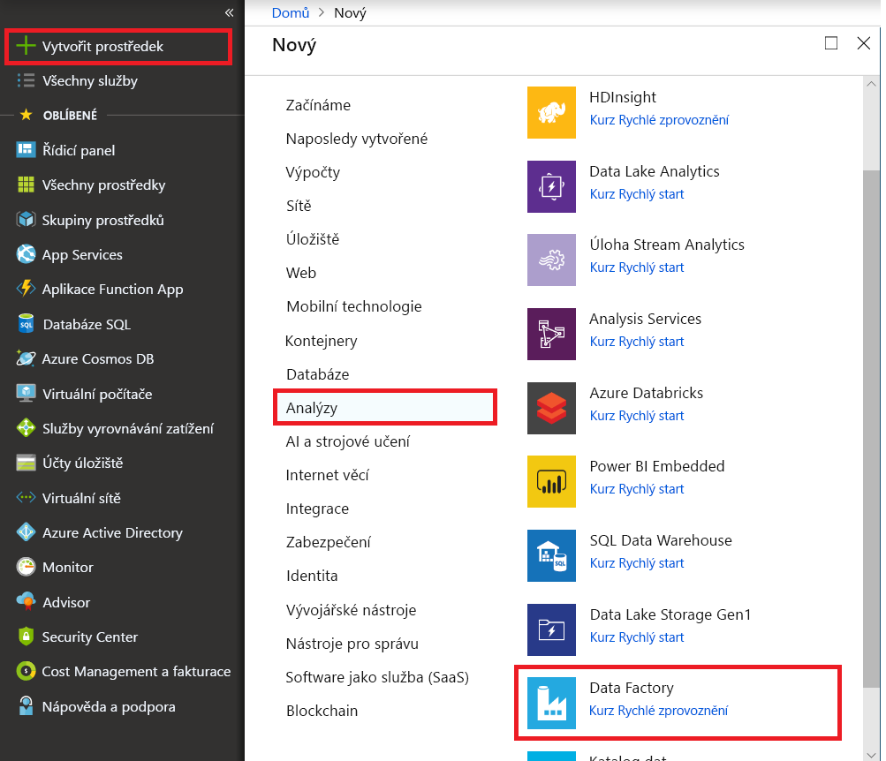

# Rychlý Start: použití nástroje Kopírování dat ke kopírování dat

> [!div class="op_single_selector" title1="Vyberte verzi Data Factory služby, kterou používáte:"]
> * [Verze 1](v1/data-factory-copy-data-from-azure-blob-storage-to-sql-database.md)
> * [Aktuální verze](quickstart-create-data-factory-copy-data-tool.md)

V tomto rychlém startu použijete Azure Portal k vytvoření datové továrny. Pak pomocí nástroje pro kopírování dat vytvoříte kanál, který kopíruje data z jedné složky v úložišti objektů blob v Azure do jiné. 

> [!NOTE]
> Pokud se službou Azure Data Factory začínáte, přečtěte si téma [Seznámení se službou Azure Data Factory](data-factory-introduction.md), než s tímto rychlým startem začnete. 

[!INCLUDE [data-factory-quickstart-prerequisites](../../includes/data-factory-quickstart-prerequisites.md)] 

## Vytvoření datové továrny

1. Spusťte webový prohlížeč **Microsoft Edge** nebo **Google Chrome**. Uživatelské rozhraní služby Data Factory podporují v současnosti jenom webové prohlížeče Microsoft Edge a Google Chrome.
1. Přejděte na [portál Azure](https://portal.azure.com). 
1. V nabídce Azure Portal vyberte **vytvořit prostředek**.

    

1. Vyberte **Analytics**a pak vyberte **Data Factory**.

   

1. Na stránce **Nová datová továrna** jako **Název** zadejte **ADFTutorialDataFactory**. 
 
   Název datové továrny Azure musí být *globálně jedinečný*. Pokud se zobrazí následující chyba, změňte název datové továrny (třeba na **&lt;váš_název_&gt;ADFTutorialDataFactory**) a zkuste to znovu. Pravidla pojmenování artefaktů služby Data Factory najdete v článku [Data Factory – pravidla pojmenování](naming-rules.md).
  
   
1. Jako **Předplatné** vyberte své předplatné Azure, ve kterém chcete datovou továrnu vytvořit. 
1. Pro položku **Skupina prostředků** proveďte jeden z následujících kroků:
     
   - Vyberte **Použít existující** a ze seznamu vyberte existující skupinu prostředků. 
   - Vyberte **Vytvořit novou** a zadejte název skupiny prostředků.   
         
   Informace o skupinách prostředků najdete v článku [Použití skupin prostředků ke správě prostředků Azure](../azure-resource-manager/resource-group-overview.md).  
1. V poli **Verze** vyberte **V2**.
1. Jako **Umístění** vyberte umístění datové továrny.

   Seznam obsahuje jenom umístění podporovaná službou Data Factory, do kterých se budou ukládat vaše metadata Azure Data Factory. Přidružená úložiště dat (například Azure Storage a Azure SQL Database) a výpočetní prostředí (například Azure HDInsight), které Data Factory používá, mohou běžet v jiných oblastech.

1. Vyberte **Vytvořit**.

1. Po vytvoření se zobrazí stránka **Datová továrna**. Kliknutím na dlaždici **Vytvořit a monitorovat** spusťte na samostatné kartě aplikaci uživatelského rozhraní služby Azure Data Factory.
   
   

## Spuštění nástroje pro kopírování dat

1. Na stránce **Let‘s get started** (Začínáme) vyberte dlaždici **Copy Data** (Kopírovat data). Spustí se nástroj pro kopírování dat. 

   

1. Na stránce **Properties** (Vlastnosti) nástroje Kopírování dat můžete zadat název kanálu a jeho popis. Pak vyberte **Next** (Další). 

   
1. Na stránce **Source data store** (Zdrojové úložiště dat) proveďte následující kroky:

    a. Kliknutím na **+ Create new connection** (+ Vytvořit nové připojení) přidejte připojení.

    b. Z Galerie vyberte **Azure Blob Storage** a pak vyberte **pokračovat**.

    c. Na stránce **Nová propojená služba (Azure Blob Storage)** zadejte název propojené služby. V seznamu **název účtu úložiště** vyberte svůj účet úložiště, otestujte připojení a pak vyberte **Dokončit**. 

   

    d. Vyberte jako zdroj nově vytvořenou propojenou službu a pak klikněte na **Další**.

1. Na stránce **Choose the input file or folder** (Zvolit vstupní soubor nebo složku) proveďte následující kroky:

   a. Klikněte na **Procházet** a přejděte do složky **adftutorial/Input** , vyberte soubor **EMP. txt** a pak klikněte na **zvolit**. 

   d. Zaškrtněte políčko **binární kopírování** pro zkopírování souboru tak, jak je, a pak vyberte **Další**. 

   

1. Na stránce **cílové úložiště dat** vyberte propojenou službu **Azure Blob Storage** , kterou jste vytvořili, a pak vyberte **Další**. 

1. Na stránce **zvolte výstupní soubor nebo složku** zadejte **adftutorial/Output** pro cestu ke složce a pak vyberte **Další**. 

    

1. Na stránce **Settings** (Nastavení) vyberte **Next** (Další), aby se použila výchozí konfigurace. 

1. Na stránce **Summary** (Souhrn) zkontrolujte všechna nastavení a vyberte **Next** (Další). 

1. Na stránce **Deployment complete** (Nasazení dokončeno) vyberte **Monitor** (Sledovat) a začněte sledovat vytvořený kanál. 

    

1. Aplikace se přepne na kartu **monitorování** . Na této kartě se zobrazí stav kanálu. Pokud chcete seznam aktualizovat, vyberte **aktualizovat** . 
    
1. Klikněte na odkaz **Zobrazit spuštění aktivit** ve sloupci **Akce**. Kanál má pouze jednu aktivitu typu **Kopírování**. 
    
1. Pokud chcete zobrazit podrobnosti o operaci kopírování, vyberte odkaz **Podrobnosti** (obrázek brýlí) ve sloupci **Akce**. Podrobnosti o vlastnostech najdete v tématu [Přehled aktivity kopírování](copy-activity-overview.md).

1. Ověřte, že se ve složce **output** kontejneru **adftutorial** vytvořil soubor **emp.txt**. Pokud výstupní složka neexistuje, Služba Data Factory ji automaticky vytvoří. 

1. Nad kartou **Monitorování** v levém panelu přepněte na kartu **Vytvořit**, kde můžete upravovat propojené služby, datové sady a kanály. Další informace o jejich úpravách v uživatelském rozhraní služby Data Factory najdete v tématu [Vytvoření datové továrny pomocí webu Azure Portal](quickstart-create-data-factory-portal.md).

## Další kroky
Kanál v této ukázce kopíruje data z jednoho umístění do jiného umístění v úložišti objektů blob v Azure. Pokud se chcete naučit používat službu Data Factory ve více scénářích, projděte si příslušné [kurzy](tutorial-copy-data-portal.md). 