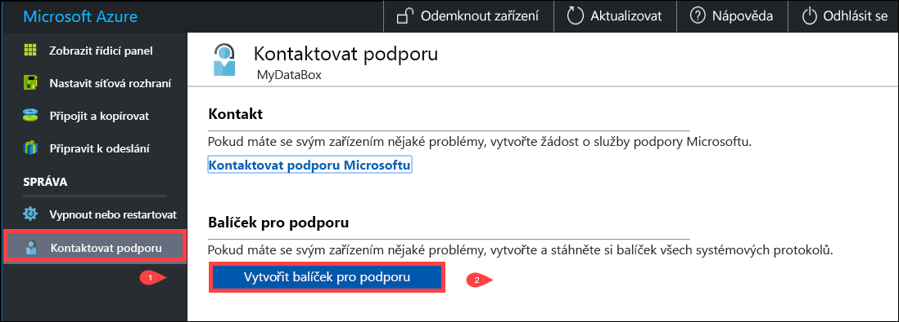
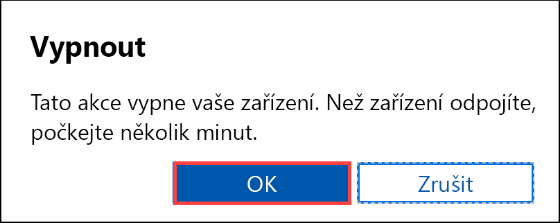
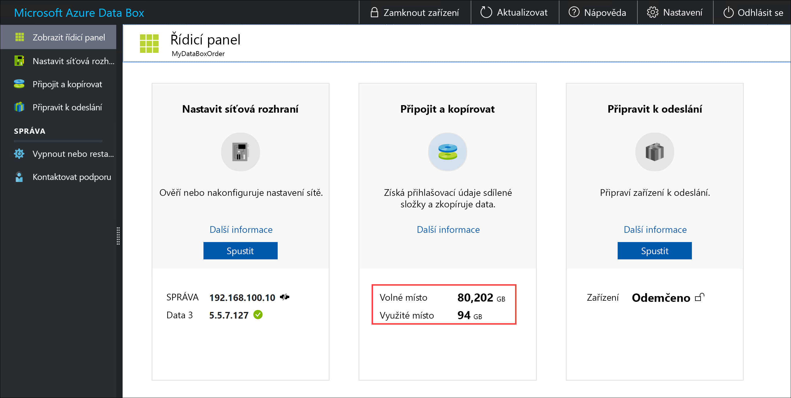
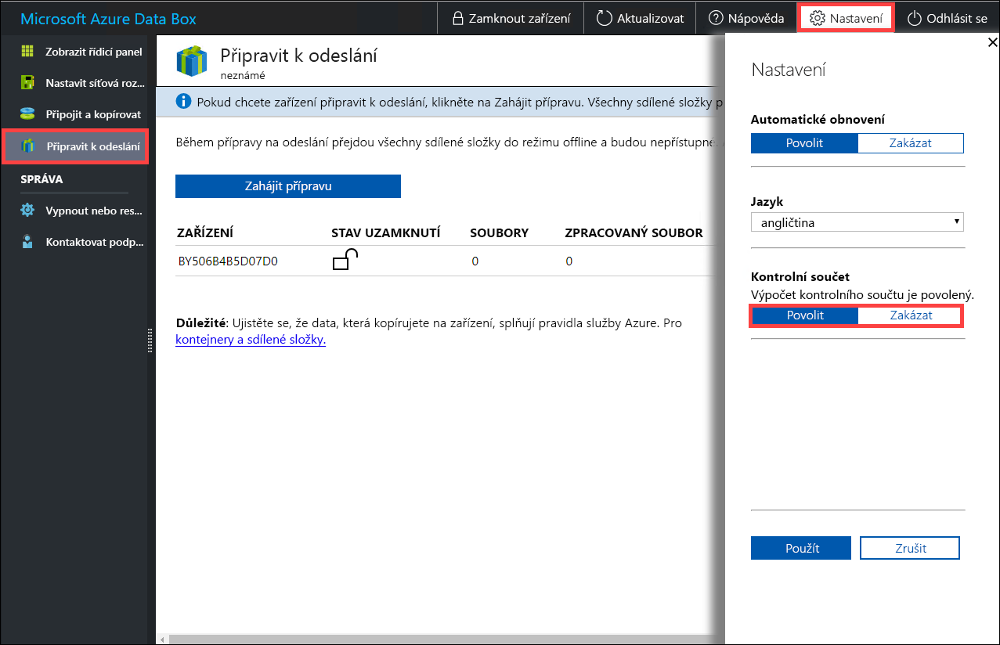

# <a name="use-the-local-web-ui-to-administer-your-data-box-and-data-box-heavy"></a>Použití místního webového uživatelského uživatelského prostředí ke správě datové schránky a datové schránky Heavy

Tento článek popisuje některé úlohy konfigurace a správy, které lze provádět na zařízeních Data Box a Data Box Heavy. Zařízení Data Box a Data Box Heavy můžete spravovat prostřednictvím uživatelského rozhraní portálu Azure a místního webového uživatelského rozhraní pro zařízení. Tento článek se zaměřuje na úlohy, které můžete provádět pomocí místního webového uživatelského rozhraní.

Pro počáteční konfiguraci zařízení se používá místní webové uživatelské rozhraní pro datovou schránku a datovou schránku Heavy. Pomocí místního webového uživatelského rozhraní můžete také vypnout nebo restartovat zařízení, spustit diagnostické testy, aktualizovat software, zobrazit protokoly kopírování a vygenerovat balíček protokolu pro podporu společnosti Microsoft. Na zařízení Data Box Heavy se dvěma nezávislými uzly můžete přistupovat ke dvěma samostatným místním webovým unám, která odpovídají jednotlivým uzlům zařízení.

Tento článek obsahuje následující návody:

- Generování balíčku pro podporu
- Vypnutí nebo restartování zařízení
- Stažení souborů kusovníku nebo manifestu
- Zobrazení dostupné kapacity zařízení
- Přeskočení ověření kontrolního součtu

## <a name="generate-support-package"></a>Generování balíčku pro podporu

Pokud budete mít se zařízením jakékoliv problémy, můžete vytvořit ze systémových protokolů balíček pro podporu. Podpora Microsoftu používá tento balíček k řešení příslušných potíží. Chcete-li vygenerovat balíček podpory, postupujte takto:

1. V místním webovém uživatelském rozhraní přejděte na **Kontaktovat podporu** a klikněte na **Vytvořit balíček pro podporu**.

    

2. Shromáždí se položky balíčku pro podporu. Tato operace trvá několik minut.

    

3. Po dokončení vytváření balíčku pro podporu klikněte na **Stáhnout balíček pro podporu**. 

    

4. Přejděte k umístění pro stahování a vyberte ho. Otevřete složku a zobrazte obsah.

    


## <a name="shut-down-or-restart-your-device"></a>Vypnutí nebo restartování zařízení

Zařízení můžete vypnout nebo restartovat pomocí místního webového uživatelského rozhraní. Doporučujeme před restartováním přepnout sdílené složky na hostiteli a potom na zařízení do offline režimu. Minimalizuje se tak možnost poškození dat. Při vypnutí zařízení zkontrolujte, že se nekopírují data.

Chcete-li zařízení vypnout, postupujte takto.

1. V místním webovém uživatelském rozhraní přejděte na **Vypnout nebo restartovat**.
2. Klikněte na **Vypnout**.

    

3. Po zobrazení výzvy k potvrzení pokračujte kliknutím na **OK**.

    

Zařízení po vypnutí zapněte tlačítkem napájení na předním panelu.

Při restartování Data Boxu postupujte podle následujících pokynů.

1. V místním webovém uživatelském rozhraní přejděte na **Vypnout nebo restartovat**.
2. Klikněte na **Restartovat**.

    

3. Po zobrazení výzvy k potvrzení pokračujte kliknutím na **OK**.

   Zařízení se vypne a restartuje.

## <a name="download-bom-or-manifest-files"></a>Stažení souborů kusovníku nebo manifestu

Kusovník (BOM) nebo soubory manifestu obsahují seznam souborů, které jsou zkopírovány do datové schránky nebo datové schránky Těžké. Tyto soubory jsou generovány při přípravě zařízení k odeslání.

Než začnete, ujistěte se, že zařízení dokončilo **připravit krok.** Stažení souborů kusovníku nebo manifestu postupujte takto:

1. Přejděte do místního webového uživatelského rozhraní pro vaše zařízení. Uvidíte, že zařízení dokončilo přípravu k odeslání. Po dokončení přípravy zařízení se stav zařízení zobrazí jako **Připravený k odeslání**.

    

2. Kliknutím na **Stáhnout seznam souborů** stáhněte seznam souborů, které byly zkopírovány do datové schránky.

    

3. V Průzkumníkovi souborů uvidíte, že samostatný seznam souborů se generuje v závislosti na protokolu použitém pro připojení k zařízení a použitém typu úložiště Azure.

    

   Následující tabulka mapuje názvy souborů na typ úložiště Azure a použitý protokol připojení.

    |Název souboru  |Typ úložiště Azure  |Použitý protokol připojení |
    |---------|---------|---------|
    |databoxe2etest_BlockBlob.txt     |Objekty blob bloku         |SMB/NFS         |
    |databoxe2etest_PageBlob.txt     |Objekty blob stránky         |SMB/NFS         |
    |databoxe2etest_AzFile-BOM.txt    |Soubory Azure         |SMB/NFS         |
    |databoxe2etest_PageBlock_Rest-BOM.txt     |Objekty blob stránky         |REST        |
    |databoxe2etest_BlockBlock_Rest-BOM.txt    |Objekty blob bloku         |REST         |
    |soubor mydbmdrg1_MDisk-BOM.txt    |Spravovaný disk         |SMB/NFS         |
    |mydbmdrg2_MDisk-BOM.txt     |Spravovaný disk         |SMB/NFS         |

Tento seznam slouží k ověření souborů nahraných do účtu Azure Storage poté, co se data box vrátí do datového centra Azure. Ukázkový soubor manifestu je uveden níže.

> [!NOTE]
> V datové schránce Heavy jsou k dispozici dvě sady souborů (soubory kusovníku), které odpovídají dvěma uzlům v zařízení.

```xml
<file size="52689" crc64="0x95a62e3f2095181e">\databox\media\data-box-deploy-copy-data\prepare-to-ship2.png</file>
<file size="22117" crc64="0x9b160c2c43ab6869">\databox\media\data-box-deploy-copy-data\connect-shares-file-explorer2.png</file>
<file size="57159" crc64="0x1caa82004e0053a4">\databox\media\data-box-deploy-copy-data\verify-used-space-dashboard.png</file>
<file size="24777" crc64="0x3e0db0cd1ad438e0">\databox\media\data-box-deploy-copy-data\prepare-to-ship5.png</file>
<file size="162006" crc64="0x9ceacb612ecb59d6">\databox\media\data-box-cable-options\cabling-dhcp-data-only.png</file>
<file size="155066" crc64="0x051a08d36980f5bc">\databox\media\data-box-cable-options\cabling-2-port-setup.png</file>
<file size="150399" crc64="0x66c5894ff328c0b1">\databox\media\data-box-cable-options\cabling-with-switch-static-ip.png</file>
<file size="158082" crc64="0xbd4b4c5103a783ea">\databox\media\data-box-cable-options\cabling-mgmt-only.png</file>
<file size="148456" crc64="0xa461ad24c8e4344a">\databox\media\data-box-cable-options\cabling-with-static-ip.png</file>
<file size="40417" crc64="0x637f59dd10d032b3">\databox\media\data-box-portal-admin\delete-order1.png</file>
<file size="33704" crc64="0x388546569ea9a29f">\databox\media\data-box-portal-admin\clone-order1.png</file>
<file size="5757" crc64="0x9979df75ee9be91e">\databox\media\data-box-safety\japan.png</file>
<file size="998" crc64="0xc10c5a1863c5f88f">\databox\media\data-box-safety\overload_tip_hazard_icon.png</file>
<file size="5870" crc64="0x4aec2377bb16136d">\databox\media\data-box-safety\south-korea.png</file>
<file size="16572" crc64="0x05b13500a1385a87">\databox\media\data-box-safety\taiwan.png</file>
<file size="999" crc64="0x3f3f1c5c596a4920">\databox\media\data-box-safety\warning_icon.png</file>
<file size="1054" crc64="0x24911140d7487311">\databox\media\data-box-safety\read_safety_and_health_information_icon.png</file>
<file size="1258" crc64="0xc00a2d5480f4fcec">\databox\media\data-box-safety\heavy_weight_hazard_icon.png</file>
<file size="1672" crc64="0x4ae5cfa67c0e895a">\databox\media\data-box-safety\no_user_serviceable_parts_icon.png</file>
<file size="3577" crc64="0x99e3d9df341b62eb">\databox\media\data-box-safety\battery_disposal_icon.png</file>
<file size="993" crc64="0x5a1a78a399840a17">\databox\media\data-box-safety\tip_hazard_icon.png</file>
<file size="1028" crc64="0xffe332400278f013">\databox\media\data-box-safety\electrical_shock_hazard_icon.png</file>
<file size="58699" crc64="0x2c411d5202c78a95">\databox\media\data-box-deploy-ordered\data-box-ordered.png</file>
<file size="46816" crc64="0x31e48aa9ca76bd05">\databox\media\data-box-deploy-ordered\search-azure-data-box1.png</file>
<file size="24160" crc64="0x978fc0c6e0c4c16d">\databox\media\data-box-deploy-ordered\select-data-box-option1.png</file>
<file size="115954" crc64="0x0b42449312086227">\databox\media\data-box-disk-deploy-copy-data\data-box-disk-validation-tool-output.png</file>
<file size="6093" crc64="0xadb61d0d7c6d4deb">\databox\data-box-cable-options.md</file>
<file size="6499" crc64="0x080add29add367d9">\databox\data-box-deploy-copy-data-via-nfs.md</file>
<file size="11089" crc64="0xc3ce6b13a4fe3001">\databox\data-box-deploy-copy-data-via-rest.md</file>
<file size="9126" crc64="0x820856b5a54321ad">\databox\data-box-overview.md</file>
<file size="10963" crc64="0x5e9a14f9f4784fd8">\databox\data-box-safety.md</file>
<file size="5941" crc64="0x8631d62fbc038760">\databox\data-box-security.md</file>
<file size="12536" crc64="0x8c8ff93e73d665ec">\databox\data-box-system-requirements-rest.md</file>
<file size="3220" crc64="0x7257a263c434839a">\databox\data-box-system-requirements.md</file>
<file size="2823" crc64="0x63db1ada6fcdc672">\databox\index.yml</file>
<file size="4364" crc64="0x62b5710f58f00b8b">\databox\data-box-local-web-ui-admin.md</file>
<file size="3603" crc64="0x7e34c25d5606693f">\databox\TOC.yml</file>
```

Tento soubor obsahuje seznam všech souborů, které byly zkopírovány na datové schránce nebo datové schránky Heavy. V tomto souboru hodnota *crc64* se vztahuje k kontrolnímu součtu generovanému pro odpovídající soubor.

## <a name="view-available-capacity-of-the-device"></a>Zobrazení dostupné kapacity zařízení

Dostupnou a využitou kapacitu zařízení můžete zobrazit na řídicím panelu zařízení.

1. V místním webovém uživatelském rozhraní přejděte na **Zobrazit řídicí panel**.
2. V části **Připojit a kopírovat** se zobrazí volné a využité místo zařízení.

    

## <a name="skip-checksum-validation"></a>Přeskočení ověření kontrolního součtu

Kontrolní součty jsou generovány pro vaše data ve výchozím nastavení při přípravě na odeslání. V některých výjimečných případech, v závislosti na datovém typu (malé velikosti souborů), může být výkon pomalý. V takových případech můžete kontrolní součet přeskočit.

Důrazně doporučujeme kontrolní součet nezakazovat, pokud to výrazně neovlivňuje výkon.

1. V pravém horním rohu místního webového uživatelského rozhraní zařízení přejděte do **části Nastavení**.

    

2. **Zakázání** ověření kontrolního součtu
3. Klikněte na **Použít**.

## <a name="next-steps"></a>Další kroky

- Přečtěte si, jak [spravovat datovou schránku a datovou schránku těžkou prostřednictvím portálu Azure](data-box-portal-admin.md).

