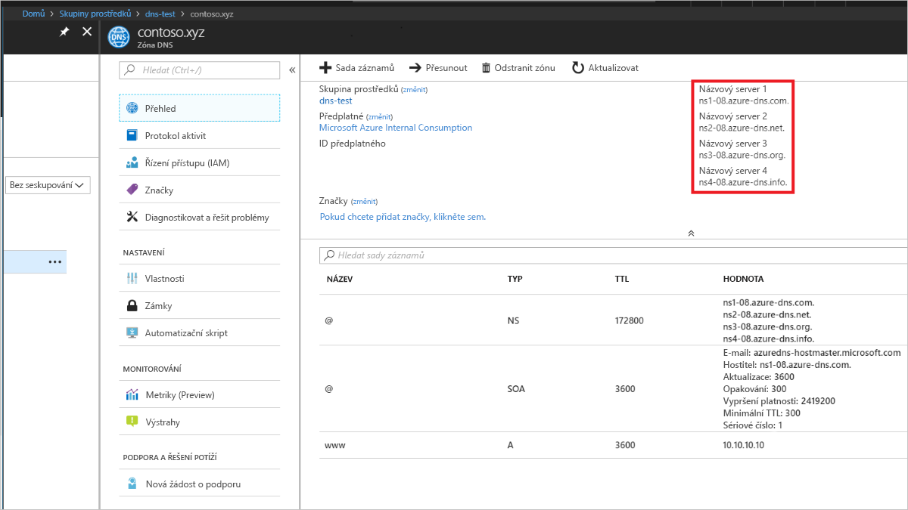

# <a name="quickstart-create-an-azure-dns-zone-and-record-using-the-azure-portal"></a>Úvodní příručka: Vytvoření zóny Azure DNS a záznam pomocí webu Azure Portal

Azure DNS můžete nakonfigurovat k překladu názvů hostitelů ve veřejné doméně. Pokud jste například zakoupili název domény *contoso.xyz* od registrátora názvů domén, můžete nakonfigurovat Azure DNS tak, aby hostoval doménu *contoso.xyz* a přemluvil *www.contoso.xyz* na IP adresu webového serveru nebo webové aplikace.

V tomto rychlém startu vytvoříte testovací doménu a potom vytvoříte záznam adresy, který vyřeší *adresu www* na adresu IP *10.10.10.10*.

>[!IMPORTANT]
>Všechny názvy a adresy IP v tomto rychlém startu jsou příklady, které nepředstavují reálné scénáře.

<!---
You can also perform these steps using [Azure PowerShell](dns-getstarted-powershell.md) or the cross-platform [Azure CLI](dns-getstarted-cli.md).
--->

Pokud nemáte předplatné Azure, vytvořte si [bezplatný účet,](https://azure.microsoft.com/free/?WT.mc_id=A261C142F) než začnete.

Pro všechny kroky portálu se přihlaste k [portálu Azure](https://portal.azure.com).

## <a name="create-a-dns-zone"></a>Vytvoření zóny DNS

Zóna DNS obsahuje položky DNS pro doménu. Chcete-li začít hostovat svou doménu ve službě Azure DNS, vytvořte pro tento název domény zónu DNS. 

**Vytvoření zóny DNS:**

1. V levém horním rohu vyberte **vytvořit prostředek**, potom **síť**a pak **zónu DNS**.

1. Na stránce **Vytvořit zónu DNS** zadejte nebo vyberte následující hodnoty:

   - **Název**: Pro tento příklad rychlého startu zadejte *contoso.xyz.* Název zóny DNS může být libovolná hodnota, která ještě není nakonfigurovaná na serverech Azure DNS. Ve skutečné situaci byste použili doménu zakoupenou od registrátora názvu domény.
   - **Skupina prostředků**: Vyberte **Vytvořit nový**, zadejte *MyResourceGroup*a vyberte **OK**. Název skupiny prostředků musí být jedinečný v rámci předplatného Azure. 

1. Vyberte **Vytvořit**.

   

Vytvoření zóny může trvat několik minut.

## <a name="create-a-dns-record"></a>Vytvoření záznamu DNS

Položky DNS nebo záznamy pro vaši doménu vytvářejí v zóně DNS. Vytvořte nový záznam adresy nebo záznam "A" pro překlad názvu hostitele na adresu IPv4.

**Vytvoření záznamu "A":**

1. Na webu Azure Portal v části **Všechny prostředky**otevřete zónu **DNS contoso.xyz** ve skupině prostředků **MyResourceGroup.** Do pole **Filtr podle názvu** můžete zadat soubor *contoso.xyz,* abyste jej snadněji našli.

1. V horní části stránky **zóny DNS** vyberte + **Record set**.

1. Na stránce **Přidat sadu záznamů** zadejte nebo vyberte následující hodnoty:

   - **Název**: Zadejte *www*. Název záznamu je název hostitele, který chcete přeložit na zadanou adresu IP.
   - **Typ**: Vyberte **a**. Nejběžnější jsou záznamy "A", ale existují i jiné typy záznamů pro poštovní servery ("MX"), adresy IP v6 ("AAAA") a tak dále. 
   - **TTL**: typ *1*. *Doba aktivního přenosu* požadavku DNS určuje, jak dlouho mohou servery a klienti DNS ukládat odpověď do mezipaměti.
   - **Jednotka TTL**: Vyberte **hodiny**. Toto je časová jednotka pro hodnotu **TTL.** 
   - **IP adresa**: Pro tento příklad rychlého startu zadejte *10.10.10.10*. Tato hodnota je IP adresa, na kterou název záznamu překládá. V reálném scénáři byste zadali veřejnou IP adresu webového serveru.

Vzhledem k tomu, že tento rychlý start je pouze pro účely rychlého testování, není nutné konfigurovat názvové servery Azure DNS u registrátora názvů domény. Se skutečnou produkční doménou budete chtít, aby kdokoli na Internetu přeřekl název hostitele pro připojení k vašemu webovému serveru nebo aplikaci. Navštívíte registrátora názvů domén a nahradíte záznamy názvového serveru názvovými servery Azure DNS. Další informace najdete [v tématu Kurz: Hostování domény v Azure DNS](dns-delegate-domain-azure-dns.md#delegate-the-domain).

## <a name="test-the-name-resolution"></a>Testování překladu IP adres

Nyní, když máte testovací zónu DNS s testovacím záznamem "A", můžete otestovat překlad názvů pomocí nástroje s názvem *nslookup*. 

**Testování překladu názvů DNS:**

1. Na webu Azure Portal v části **Všechny prostředky**otevřete zónu **DNS contoso.xyz** ve skupině prostředků **MyResourceGroup.** Do pole **Filtr podle názvu** můžete zadat soubor *contoso.xyz,* abyste jej snadněji našli.

1. Zkopírujte jeden z názvů názvového serveru ze seznamu názvového serveru na stránce **Přehled.** 

   

1. Otevřete příkazový řádek a spusťte následující příkaz:

   ```
   nslookup www.contoso.xyz <name server name>
   ```

   Například:

   ```
   nslookup www.contoso.xyz ns1-08.azure-dns.com.
   ```

   Měli byste vidět něco jako následující obrazovka:

   

Název hostitele **\.www contoso.xyz** se překládá na **10.10.10.10**, stejně jako jste ho nakonfigurovali. Tento výsledek ověří, že překlad názvů funguje správně. 

## <a name="clean-up-resources"></a>Vyčištění prostředků

Pokud již nepotřebujete prostředky vytvořené v tomto rychlém startu, odeberte je odstraněním skupiny prostředků **MyResourceGroup.** Otevřete skupinu prostředků **MyResourceGroup** a vyberte **Odstranit skupinu prostředků**.

## <a name="next-steps"></a>Další kroky

> [!div class="nextstepaction"]
> [Vytvoření záznamů DNS pro webovou aplikaci ve vlastní doméně](./dns-web-sites-custom-domain.md)