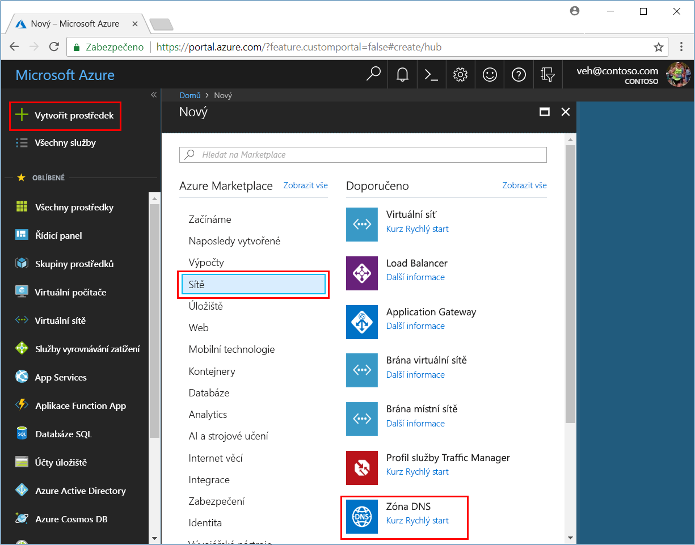

# <a name="quickstart-configure-azure-dns-for-name-resolution-using-the-azure-portal"></a>Rychlý start: Konfigurace Azure DNS k překladu názvů pomocí webu Azure Portal

 Azure DNS můžete nakonfigurovat k překladu názvů hostitelů ve veřejné doméně. Pokud jste například zakoupili název domény contoso.com od registrátora názvů domén, můžete nakonfigurovat Azure DNS pro hostování domény contoso.com a přeložit www.contoso.com na IP adresu vašeho webového serveru nebo webové aplikace.

V tomto rychlém startu vytvoříte testovací doménu a potom vytvoříte záznam adresy s názvem „www“, který ji přeloží na IP adresu 10.10.10.10.

Mějte na paměti, že všechny názvy a IP adresy použité v tomto rychlém startu jsou jenom příklady a neodpovídají skutečným situacím. V určitých případech jsou ale popsané i skutečné situace.

<!---
You can also perform these steps using [Azure PowerShell](dns-getstarted-powershell.md) or the cross-platform [Azure CLI](dns-getstarted-cli.md).
--->

K uložení položek DNS v určité doméně se používá zóna DNS. Pokud chcete začít hostovat svou doménu v DNS Azure, musíte vytvořit zónu DNS pro daný název domény. Všechny položky (nebo záznamy) DNS pro vaši doménu se pak vytvoří v této zóně DNS. Následující kroky vám ukážou, jak na to.

Pokud ještě nemáte předplatné Azure, vytvořte si [bezplatný účet](https://azure.microsoft.com/free/?WT.mc_id=A261C142F) před tím, než začnete.

## <a name="create-a-dns-zone"></a>Vytvoření zóny DNS

1. Přihlaste se k portálu Azure.
2. Vlevo nahoře klikněte na **+ Vytvořit prostředek**, potom na **Sítě** a nakonec na **Zóna DNS**. Otevře se stránka **Vytvořit zónu DNS**.

    

4. Na stránce **Vytvořit zónu DNS** zadejte následující hodnoty a potom klikněte na **Vytvořit**:


   | **Nastavení** | **Hodnota** | **Podrobnosti** |
   |---|---|---|
   |**Název**|contoso.xyz|Jako název zóny DNS může v tomto příkladu posloužit jakákoli hodnota, kterou chcete v tomto rychlém startu použít, pokud už není nakonfigurovaná na serverech Azure DNS. Ve skutečné situaci byste použili doménu zakoupenou od registrátora názvu domény.|
   |**Předplatné**|[Vaše předplatné]|Vyberte předplatné, ve kterém chcete vytvořit zónu DNS.|
   |**Skupina prostředků**|**Vytvořit nový:** dns-test|Vytvořte skupinu prostředků. Název skupiny prostředků musí být v rámci vybraného předplatného jedinečný. |
   |**Umístění**|USA – východ||

Vytvoření zóny může trvat několik minut.

## <a name="create-a-dns-record"></a>Vytvoření záznamu DNS

Nyní vytvořte nový záznam adresy (záznam „A“). Záznamy „A“ se používají k překladu názvu hostitele na adresu IPv4.

1. Na webu Azure Portal v podokně **Oblíbené** klikněte na **Všechny prostředky**. Na stránce Všechny prostředky klikněte na zónu DNS **contoso.xyz**. Pokud předplatné, které jste vybrali, již nějaké prostředky obsahovalo, můžete zadat **contoso.xyz** do pole **Filtrovat podle názvu...** pro snadný přístup k zóně DNS.

1. V horní části stránky **Zóna DNS** vyberte **Sada záznamů**. Otevře se stránka **Přidat sadu záznamů**.

1. Na stránce **Přidat sadu záznamů** zadejte následující hodnoty a klikněte na **OK**. V tomto příkladu vytvoříte záznam „A“.

   |**Nastavení** | **Hodnota** | **Podrobnosti** |
   |---|---|---|
   |**Název**|www|Název záznamu. Tento název použijete pro hostitele, kterého chcete přeložit na IP adresu.|
   |**Typ**|A| Typ záznamu DNS, který se má vytvořit. Záznamy „A“ jsou nejběžnější, ale existují i jiné typy záznamů pro poštovní servery (MX), adresy IPv6 (AAAA) atd. |
   |**Hodnota TTL**|1|Hodnota TTL (Time to Live) žádosti DNS. Určuje, po jak dlouhou dobu mohou DNS servery a klienti ukládat odpovědi do mezipaměti.|
   |**Jednotka hodnoty TTL**|hours|Měřené jednotky času pro hodnotu TTL.|
   |**IP adresa**|10.10.10.10| Tato hodnota je IP adresa, na kterou se záznam „A“ překládá. Jde pouze o testovací hodnotu pro účely tohoto rychlého startu. Ve skutečné situaci byste zadali veřejnou IP adresu vašeho webového serveru.|


Protože si v tomto rychlém startu skutečný název domény nekupujete, není nutné u svého registrátora názvu domény konfigurovat Azure DNS jako název serveru. Ve skutečné situaci by však měli být všichni uživatelé internetu schopní název hostitele přeložit, aby se mohli připojit k vašemu webovému serveru nebo aplikaci. Další informace o této skutečné situaci najdete v tématu [Delegování domény do Azure DNS](dns-delegate-domain-azure-dns.md).


## <a name="test-the-name-resolution"></a>Testování překladu IP adres

Když už máte testovací zónu se záznamem „A“, můžete překlad názvů otestovat nástrojem *nslookup*. 

1. Nejprve si poznamenejte názvové servery Azure DNS, které chcete v nástroji nslookup použít. 

   Názvové servery vaší zóny jsou uvedené na stránce **Přehled** zóny DNS. Zkopírujte název jednoho z názvových serverů:

   

2. Otevřete příkazový řádek a spusťte následující příkaz:

   ```
   nslookup <host name> <name server>
   
   For example:

   nslookup www.contoso.xyz ns1-08.azure-dns.com
   ```

Mělo by se zobrazit něco podobného jako následující snímek obrazovky:


Tímto se ověřilo, že překlad názvů funguje správně. Adresa www.contoso.xyz se překládá na IP adresu 10.10.10.10, přesně v souladu s konfigurací, kterou jste nastavili.

## <a name="clean-up-resources"></a>Vyčištění prostředků

Pokud už nejsou potřeba, můžete všechny prostředky vytvořené v rámci tohoto rychlého startu odstranit odstraněním skupiny prostředků **dns-test**. Pokud chcete skupinu prostředků odstranit, klikněte na **dns-test** a pak klikněte na **Odstranit skupinu prostředků**.


## <a name="next-steps"></a>Další kroky

> [!div class="nextstepaction"]
> [Vytvoření záznamů DNS pro webovou aplikaci ve vlastní doméně](./dns-web-sites-custom-domain.md)