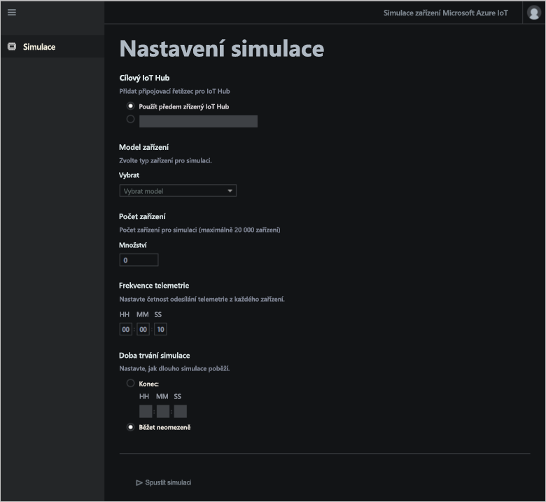

# Co jsou akcelerátory řešení Azure IoT?

Cloudové řešení IoT obvykle používá vlastní kód a cloudové služby ke správě zařízení připojení, zpracování dat a analýzy a prezentace.

Akcelerátory řešení IoT je dokončena, připraveno k nasazení řešení IoT, které implementují běžné scénáře IoT. Scénáře patří vzdálené monitorování, propojené továrny, prediktivní údržby a simulaci zařízení. Když nasadíte akcelerátor řešení, součástí nasazení jsou všechny požadované cloudové služby i veškerý požadovaný kód aplikace.

Akcelerátory řešení představují výchozí body pro vaše vlastní řešení IoT. Zdrojový kód všech akcelerátorů řešení je open source a dostupný na GitHubu. Akcelerátory řešení si můžete stáhnout a přizpůsobit podle svých potřeb.

Akcelerátory řešení můžete využít také jako učební nástroje před tím, než vytvoříte vlastní řešení IoT od nuly. Akcelerátory řešení implementují osvědčené postupy pro cloudová řešení IoT, které byste měli dodržovat.

Kód aplikace v každém akcelerátoru řešení obsahuje webovou aplikaci, ve které můžete akcelerátor řešení spravovat.

## Podporované scénáře IoT

V současné době jsou k dispozici čtyři akcelerátory řešení, které můžete nasadit:

### Vzdálené monitorování

Použití [akcelerátor řešení vzdálené monitorování](iot-accelerators-remote-monitoring-sample-walkthrough.md) shromažďovat telemetrii ze vzdáleného zařízení a jejich řízení. Mezi příklady zařízení patří chladící systémy nainstalované u vašich zákazníků nebo ventily nainstalované na vzdálených čerpacích stanicích.

Pomocí řídicího panelu vzdáleného monitorování můžete zobrazit telemetrii z připojených zařízení, zřizovat nová zařízení nebo upgradovat firmware na připojených zařízeních:

### Propojená továrna

Použití [akcelerátor řešení připojená továrna](iot-accelerators-connected-factory-features.md) můžete shromažďovat telemetrii z průmyslových prostředků s [OPC Unified architektura](https://opcfoundation.org/about/opc-technologies/opc-ua/) rozhraní a jejich řízení. Mezi průmyslové prostředky můžou patřit montážní a testovací stanice na výrobní lince továrny.

Pomocí řídicího panelu propojené továrny můžete monitorovat a spravovat svá průmyslová zařízení:

### Prediktivní údržba

Použití [akcelerátor řešení prediktivní údržby](iot-accelerators-predictive-walkthrough.md) předpovědět očekávaného selhat, takže je možné souběžně provádět údržbu předtím, než selhání zařízení vzdálené zařízení. Tento akcelerátor řešení k předvídání selhání na základě telemetrie zařízení využívá algoritmy strojového učení. Příklady zařízení můžou být letadlové motory nebo výtahy.

Pomocí řídicího panelu prediktivní údržby můžete zobrazit analýzu prediktivní údržby:

### Simulace zařízení

Použití [akcelerátor řešení simulace zařízení](iot-accelerators-device-simulation-overview.md) spustit Simulovaná zařízení, které generují realistickou telemetrií. Pomocí tohoto akcelerátoru řešení můžete testovat chování ostatních akcelerátorů řešení nebo testovat vlastní řešení IoT.

Pomocí webové aplikace simulace zařízení můžete konfigurovat a spouštět simulace:

## Principy návrhu

Všechny akcelerátory řešení se řídí stejnými principy návrhu a mají stejné cíle. Jsou navržené tak, aby byly:

* **Škálovatelné** – umožňují vám připojit a spravovat miliony připojených zařízení.
* **Rozšiřitelné** – umožňují vám přizpůsobit je tak, aby splňovaly vaše požadavky.
* **Srozumitelné** – umožňují vám pochopit, jak fungují a jak se implementují.
* **Modulární** – umožňují vám vyměňovat služby za alternativy.
* **Bezpečné** – kombinují zabezpečení Azure s integrovanými možnostmi připojení a funkcemi zabezpečení zařízení.

## Architektury a jazyky

Původní akcelerátory řešení byly napsané v .NET a využívaly architekturu MVC (model-view-controller). Společnost Microsoft aktualizuje akcelerátory řešení, aby využívaly novou architekturu mikroslužeb. Následující tabulka ukazuje aktuální stav akcelerátorů řešení s odkazy na úložiště GitHub:

| Akcelerátor řešení   | Architektura  | Jazyky     |
| ---------------------- | ------------- | ------------- |
| Vzdálené monitorování      | Mikroslužby | [Java](https://github.com/Azure/azure-iot-pcs-remote-monitoring-java) a [.NET](https://github.com/Azure/azure-iot-pcs-remote-monitoring-dotnet) |
| Prediktivní údržba | MVC           | [.NET](https://github.com/Azure/azure-iot-predictive-maintenance)          |
| Propojená továrna      | MVC           | [.NET](https://github.com/Azure/azure-iot-connected-factory)          |
| Simulace zařízení      | Mikroslužby | [.NET](https://github.com/Azure/device-simulation-dotnet)          |

Další informace o architektuře mikroslužeb najdete v tématu [Úvod do služby Azure IoT referenční architektura](iot-accelerators-architecture-overview.md).

## Možnosti nasazení

Akcelerátory řešení můžete nasadit na webu [Akcelerátory řešení Microsoft Azure IoT](https://www.azureiotsolutions.com/Accelerators#) nebo pomocí příkazového řádku.

Akcelerátor řešení pro vzdálené monitorování můžete nasadit v následujících konfiguracích:

* **Standard:** Nasazení rozšířené infrastruktury pro vývoj produkčního nasazení. Azure Container Service nasazuje mikroslužby do několika virtuálních počítačů Azure. Kubernetes orchestruje kontejnery Dockeru, které jsou hostiteli jednotlivých mikroslužeb.
* **Basic:** Verze nižšími náklady pro ukázku nebo otestování nasazení. Všechny mikroslužby se nasazují do jednoho virtuálního počítače Azure.
* **Místní:** Nasazení místního počítače pro vývoj a testování. S tímto přístupem se mikroslužby nasazují do místního kontejneru Dockeru a připojují se ke službám IoT Hub, Azure Cosmos DB a Azure Storage v cloudu.

Náklady na provozování akcelerátoru řešení je kombinovaná [náklady na provozování podpůrné služby Azure](https://azure.microsoft.com/pricing). Podrobnosti o použitých službách Azure se zobrazí po výběru možností nasazení.

## Další postup

Pokud si chcete vyzkoušet některý z akcelerátorů řešení IoT, projděte si následující rychlé starty:

* [Vyzkoušení řešení vzdáleného monitorování](quickstart-remote-monitoring-deploy.md)
* [Vyzkoušení řešení propojené továrny](quickstart-connected-factory-deploy.md)
* [Vyzkoušení řešení prediktivní údržby](quickstart-predictive-maintenance-deploy.md)
* [Vyzkoušení řešení simulace zařízení](quickstart-device-simulation-deploy.md)
