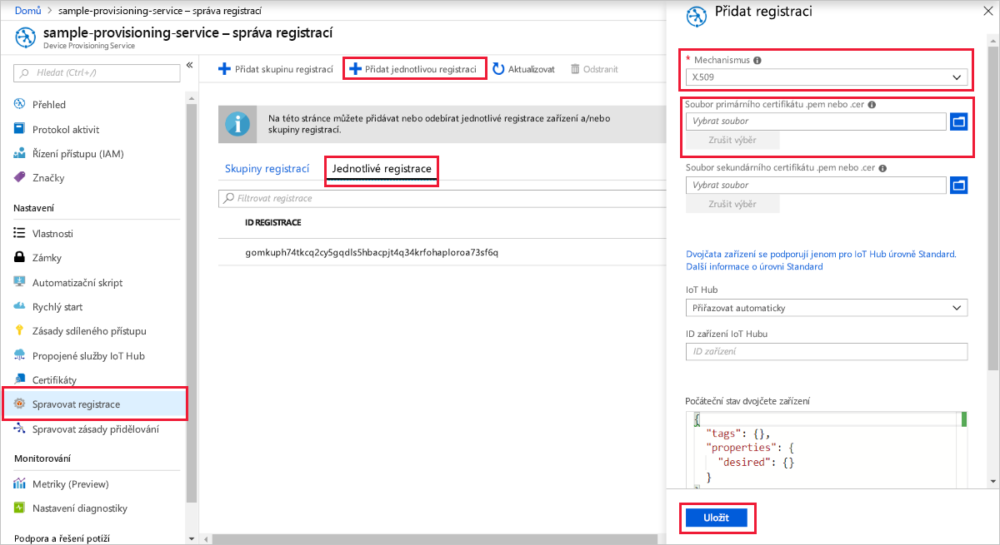

# <a name="quickstart-create-and-provision-a-simulated-x509-device-using-c-device-sdk-for-iot-hub-device-provisioning-service"></a>Úvodní příručka: Vytvoření a zřízení simulovaného zařízení X.509 pomocí sady SDK zařízení C# pro službu zřizování zařízení služby IoT Hub

[!INCLUDE [iot-dps-selector-quick-create-simulated-device-x509](../../includes/iot-dps-selector-quick-create-simulated-device-x509.md)]

Tyto kroky ukazují, jak použít [ukázky Azure IoT pro C#](https://github.com/Azure-Samples/azure-iot-samples-csharp) k simulaci zařízení X.509 ve vývojovém počítači se systémem Windows OS. Ukázka také připojí simulované zařízení k centru IoT Hub pomocí služby zřizování zařízení.

Pokud nejste obeznámeni s procesem automatického zřizování, nezapomeňte také zkontrolovat [koncepty automatického zřizování](concepts-auto-provisioning.md). Než budete pokračovat, ujistěte se také, že jste provedli kroky uvedené v tématu [Nastavení služby IoT Hub Device Provisioning Service pomocí webu Azure Portal](./quick-setup-auto-provision.md). 

Služba Azure IoT Device Provisioning podporuje dva typy registrací:
- [Skupiny registrací:](concepts-service.md#enrollment-group) Slouží k registraci několika souvisejících zařízení.
- [Jednotlivé registrace:](concepts-service.md#individual-enrollment) Slouží k registraci jednoho zařízení.

V tomto článku si předvedeme jednotlivé registrace.

[!INCLUDE [IoT Device Provisioning Service basic](../../includes/iot-dps-basic.md)]

<a id="setupdevbox"></a>
## <a name="prepare-the-development-environment"></a>Příprava vývojového prostředí 

1. Ujistěte se, že máte v počítači nainstalovanou sadu [.NET Core 2.1 SDK nebo novější.](https://www.microsoft.com/net/download/windows) 

1. Ujistěte se, že je na vašem počítači nainstalovaný `git` a že je přidaný do proměnných prostředí, ke kterým má příkazové okno přístup. Na stránce [klientských nástrojů Git organizace Software Freedom Conservancy](https://git-scm.com/download/) najdete nejnovější verzi nástrojů `git` k instalaci. Jejich součástí je i **Git Bash**, aplikace příkazového řádku, pomocí které můžete pracovat se svým místním úložištěm Git. 

1. Otevřete příkazový řádek nebo Git Bash. Klonování ukázek Azure IoT pro úložiště C# GitHub:
    
    ```cmd
    git clone https://github.com/Azure-Samples/azure-iot-samples-csharp.git
    ```

## <a name="create-a-self-signed-x509-device-certificate-and-individual-enrollment-entry"></a>Vytvoření certifikátu zařízení X.509 podepsaného svým držitelem a položky jednotlivé registrace

V této části budete používat certifikát X.509 podepsaný svým držitelem. Je důležité vzít v úvahu následující body:

* Certifikáty podepsané svým držitelem jsou určené jenom pro testování a neměly by se používat v produkčním prostředí.
* Výchozí datum vypršení platnosti certifikátu podepsaného svým držitelem je jeden rok.

Ukázkový kód z [ukázky zřizovacího zařízení klienta - X.509 Potvrzení](https://github.com/Azure-Samples/azure-iot-samples-csharp/tree/master/provisioning/Samples/device/X509Sample) k vytvoření certifikátu, který má být použit s jednotlivou položkou zápisu pro simulované zařízení.


1. V příkazovém řádku přejděte do adresáře projektu s ukázkou zřizování zařízení X.509.

    ```cmd
    cd .\azure-iot-samples-csharp\provisioning\Samples\device\X509Sample
    ```

2. Vzorový kód je nastavený tak, aby používal certifikáty X.509 uložené v souboru ve formátu PKCS12 chráněném heslem (certificate.pfx). Kromě toho potřebujete soubor certifikátu veřejného klíče (certificate.cer) k vytvoření individuálního zápisu později v tomto rychlém startu. Pokud chcete vygenerovat certifikát podepsaný svým držitelem a přidružené soubory .cer a .pfx, spusťte následující příkaz:

    ```cmd
    powershell .\GenerateTestCertificate.ps1
    ```

3. Skript váz vyzve k zadání hesla PFX. Toto heslo si zapamatujte, protože ho musíte použít při spuštění ukázky.

      


4. Přihlaste se k portálu Azure, vyberte tlačítko **Všechny prostředky** v levé nabídce a otevřete zřizovací službu.

5. V nabídce Služba zřizování zařízení vyberte **Spravovat registrace**. Vyberte **kartu Jednotlivé registrace** a nahoře vyberte tlačítko Přidat jednotlivé **zápisy.** 

6. V panelu **Přidat zápis** zadejte následující informace:
   - Jako *Mechanismus* ověření identity vyberte **X.509**.
   - V části *Primární certifikát .pem nebo soubor CER*zvolte Vybrat *soubor,* který chcete vybrat **soubor certifikátu.**
   - **ID zařízení** nechte prázdné. Vaše zařízení se zřídí s ID zařízení nastaveným na běžný název v certifikátu X.509, tedy **iothubx509device1**. Tento název se použije také jako ID registrace pro položku jednotlivé registrace. 
   - Volitelně můžete zadat následující informace:
       - Vyberte centrum IoT propojené s vaší zřizovací službou.
       - Aktualizujte **Počáteční stav dvojčete zařízení** s použitím požadované počáteční konfigurace zařízení.
   - Po dokončení stiskněte tlačítko **Uložit.** 

     [](./media/quick-create-simulated-device-x509-csharp/device-enrollment.png#lightbox)
    
   Po úspěšné registraci se záznam vaší registrace X.509 zobrazí jako **iothubx509device1** ve sloupci *ID registrace* na kartě *Jednotlivé registrace*. 

## <a name="provision-the-simulated-device"></a>Zřízení simulovaného zařízení

1. V okně **Přehled** pro službu zřizování si poznamenejte hodnotu **_oboru ID._**

     


2. Zadejte následující příkaz, který sestaví a spustí ukázku zřizování zařízení X.509. Hodnotu `<IDScope>` nahraďte hodnotou Rozsah ID pro vaši službu zřizování. 

    ```cmd
    dotnet run <IDScope>
    ```

3. Po zobrazení výzvy zadejte heslo k souboru PFX, který jste vytvořili dříve. Všimněte si zpráv, které simulují spouštění zařízení a jeho připojování ke službě Device Provisioning pro získání informací o vašem centru IoT. 

     

4. Ověřte zřízení zařízení. Při úspěšném zřizování simulovaného zařízení do centra IoT propojeného s vaší zřizovací službou se ID zařízení zobrazí na okně **zařízení IoT** centra. 

     

    Pokud jste v položce registrace pro vaše zařízení změnili *počáteční stav dvojčete zařízení* z výchozí hodnoty, může si zařízení požadovaný stav dvojčete vyžádat z centra a příslušně na něj reagovat. Další informace najdete [v tématu Principy a používání dvojčat zařízení v centru IoT Hub.](../iot-hub/iot-hub-devguide-device-twins.md)


## <a name="clean-up-resources"></a>Vyčištění prostředků

Pokud máte v plánu pokračovat v práci a zkoumání ukázky klienta zařízení, nečistěte prostředky vytvořené v tomto rychlém startu. Pokud neplánujete pokračovat, odstraňte pomocí následujících kroků všechny prostředky vytvořené tímto rychlým startem.

1. Zavřete na svém počítači okno výstupu ukázky klienta zařízení.
1. Zavřete na svém počítači okno simulátoru TPM.
1. V levé nabídce na webu Azure Portal vyberte **Všechny prostředky** a pak vyberte službu Zřizování zařízení. V horní části okna **Přehled** stiskněte **klávesu Delete** v horní části podokna.  
1. V levé nabídce na webu Azure Portal vyberte **Všechny prostředky** a pak vyberte své centrum IoT. V horní části okna **Přehled** stiskněte **klávesu Delete** v horní části podokna.  

## <a name="next-steps"></a>Další kroky

V tomto rychlém startu jste na počítači s Windows vytvořili simulované zařízení X.509 a zřídíte ho do vašeho centra IoT hub pomocí služby Azure IoT Hub Device Provisioning Service na portálu. Chcete-li se dozvědět, jak zaregistrovat zařízení X.509 programově, pokračujte na rychlém startu pro programovou registraci zařízení X.509. 

> [!div class="nextstepaction"]
> [Azure quickstart – registrace zařízení X.509 do služby Azure IoT Hub Device Provisioning Service](quick-enroll-device-x509-csharp.md)
