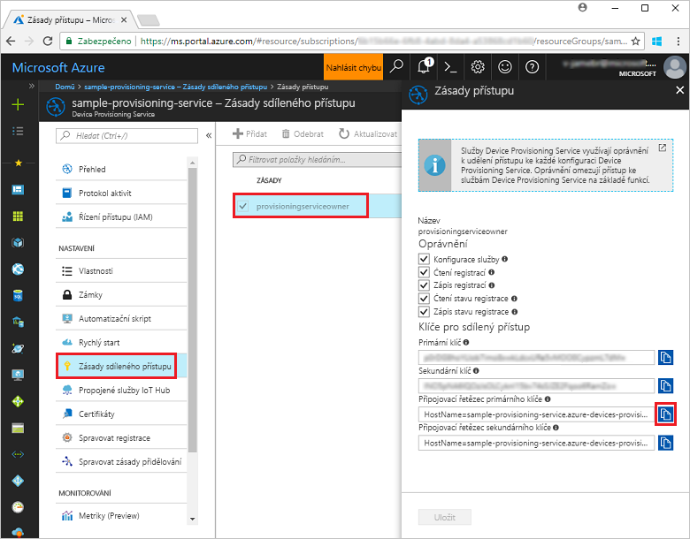
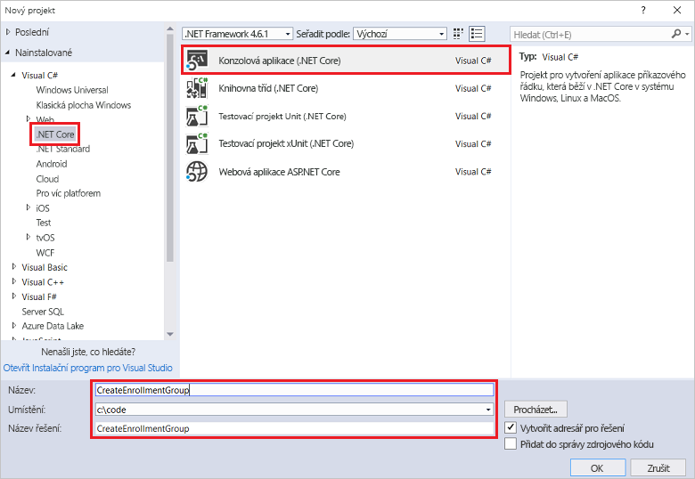

# <a name="quickstart-enroll-x509-devices-to-the-device-provisioning-service-using-c"></a>Rychlý start: Registrace zařízení X.509 do služby Device Provisioning pomocíC#

[!INCLUDE [iot-dps-selector-quick-enroll-device-x509](../../includes/iot-dps-selector-quick-enroll-device-x509.md)]


Tento rychlý start ukazuje, jak prostřednictvím kódu programu v C# vytvořit [skupinu registrací](concepts-service.md#enrollment-group), která používá zprostředkující nebo kořenové certifikáty X.509 certifikační autority. Skupina registrací se vytvoří pomocí [sady Microsoft Azure IoT SDK pro .NET](https://github.com/Azure/azure-iot-sdk-csharp) a ukázkové aplikace .NET Core v jazyce C#. Skupina registrací řídí přístup ke službě zřizování pro zařízení, která ve svém řetězu certifikátů sdílejí společný podpisový certifikát. Další informace najdete v tématu [Řízení přístupu zařízení ke službě zřizování pomocí certifikátů X.509](./concepts-security.md#controlling-device-access-to-the-provisioning-service-with-x509-certificates). Další informace o používání infrastruktury veřejných klíčů (PKI) založené na certifikátech X.509 se službami Azure IoT Hub a Device Provisioning najdete v tématu [Přehled zabezpečení pomocí certifikátu webu X.509](https://docs.microsoft.com/azure/iot-hub/iot-hub-x509ca-overview). 

Tento rychlý start vychází z předpokladu, že už jste vytvořili centrum IoT a instanci služby Device Provisioning Service. Pokud jste tyto prostředky ještě nevytvořili, před tímto článkem si projděte rychlý start [Nastavení služby IoT Hub Device Provisioning pomocí webu Azure Portal](./quick-setup-auto-provision.md).

Přestože postup v tomto článku funguje na počítačích s Windows i Linuxem, tento článek pracuje s vývojovým počítačem s Windows.

[!INCLUDE [quickstarts-free-trial-note](../../includes/quickstarts-free-trial-note.md)]


## <a name="prerequisites"></a>Požadavky

* Nainstalujte [Visual Studio 2017](https://www.visualstudio.com/vs/).
* Nainstalujte [.NET Core SDK](https://www.microsoft.com/net/download/windows).
* Nainstalujte [Git](https://git-scm.com/download/).


## <a name="prepare-test-certificates"></a>Příprava testovacích certifikátů

Pro účely tohoto rychlého startu potřebujete soubor .pem nebo .cer, který obsahuje veřejnou část zprostředkujícího nebo kořenového certifikátu X.509 certifikační autority. Certifikát musí být nahraný do vaší služby zřizování a ověřený touto službou. 

Sada [SDK služby Azure IoT pro jazyk C](https://github.com/Azure/azure-iot-sdk-c) obsahuje testovací nástroje, které vám můžou pomoct vytvořit řetěz certifikátů X.509, nahrát kořenový nebo zprostředkující certifikát z tohoto řetězu a ověřit certifikát testováním vlastnictví pomocí této služby. Certifikáty vytvořené pomocí nástrojů sady SDK jsou určené **jenom k testování během vývoje**. Tyto certifikáty **se nesmí používat v produkčním prostředí**. Obsahují pevně zakódovaná hesla („1234“), jejichž platnost vyprší po 30 dnech. Informace o získání certifikátů vhodných pro použití v produkčním prostředí najdete v tématu věnovaném [získání certifikátu webu X.509](https://docs.microsoft.com/azure/iot-hub/iot-hub-x509ca-overview#how-to-get-an-x509-ca-certificate) v dokumentaci ke službě Azure IoT Hub.

Pokud chcete vygenerovat certifikáty pomocí těchto testovacích nástrojů, proveďte následující kroky: 
 
1. Otevřete příkazový řádek nebo prostředí Git Bash a přejděte do pracovní složky na svém počítači. Spusťte následující příkaz pro naklonování úložiště GitHub sady [Azure IoT C SDK](https://github.com/Azure/azure-iot-sdk-c):
    
   ```cmd/sh
   git clone https://github.com/Azure/azure-iot-sdk-c.git --recursive
   ```

   Velikost tohoto úložiště je aktuálně přibližně 220 MB. Buďte připravení na to, že může trvat i několik minut, než se tato operace dokončí.

   Testovací nástroje se nacházejí ve složce *azure-iot-sdk-c/tools/CACertificates* úložiště, které jste naklonovali.    

2. Ukázky a kurzy najdete v článku [Správa testovacích certifikátů certifikační autority](https://github.com/Azure/azure-iot-sdk-c/blob/master/tools/CACertificates/CACertificateOverview.md). 

Kromě nástrojů v sadě SDK pro jazyk C předvádí [ukázka ověření certifikátu skupiny](https://github.com/Azure-Samples/azure-iot-samples-csharp/tree/master/provisioning/Samples/service/GroupCertificateVerificationSample) v sadě *SDK Microsoft Azure IoT pro .NET*, jak v jazyce C# provést test vlastnictví pomocí existujícího zprostředkujícího nebo kořenového certifikátu X.509 certifikační autority. 


## <a name="get-the-connection-string-for-your-provisioning-service"></a>Získání připojovacího řetězce pro službu zřizování

Pro ukázku v tomto rychlém startu potřebujete připojovací řetězec pro vaši službu zřizování.
1. Přihlaste se k webu Azure Portal, v nabídce vlevo klikněte na tlačítko **Všechny prostředky** a otevřete svou službu Device Provisioning Service. 
2. Klikněte na **Zásady sdíleného přístupu** a pak kliknutím na zásadu přístupu, kterou chcete použít, otevřete její vlastnosti. V okně **Zásady přístupu** si zkopírujte a poznamenejte primární připojovací řetězec klíče. 

    

## <a name="create-the-enrollment-group-sample"></a>Vytvoření ukázky skupiny registrací 

Kroky v této části ukazují, jak vytvořit konzolovou aplikaci .NET Core, která do vaší služby zřizování přidá skupinu registrací. S určitými úpravami můžete pomocí tohoto postupu vytvořit pro přidání skupiny registrací také konzolovou aplikaci [Windows IoT Core](https://developer.microsoft.com/en-us/windows/iot). Další informace o vývoji s využitím IoT Core najdete v [dokumentaci pro vývojáře pro Windows IoT Core](https://docs.microsoft.com/windows/iot-core/).
1. V sadě Visual Studio přidejte k novému řešení projekt konzolové aplikace Visual C# .NET Core pomocí šablony projektu **Konzolová aplikace (.NET Core)**. Zkontrolujte, zda máte verzi rozhraní .NET Framework 4.5.1 nebo novější. Pojmenujte projekt **CreateEnrollmentGroup**.

    

2. V Průzkumníku řešení klikněte pravým tlačítkem na projekt **CreateEnrollmentGroup** a pak klikněte na **Správa balíčků NuGet**.
3. V okně **Správce balíčků NuGet** vyberte **Procházet**, vyhledejte **Microsoft.Azure.Devices.Provisioning.Service**, vyberte **Nainstalovat**, čímž nainstalujete balíček **Microsoft.Azure.Devices.Provisioning.Service**, a přijměte podmínky použití. Tímto postupem se stáhne a nainstaluje balíček NuGet [klientské sady SDK pro službu Azure IoT Device Provisioning](https://www.nuget.org/packages/Microsoft.Azure.Devices.Provisioning.Service/) a jeho závislosti a přidá se na něj odkaz.

    

4. Na začátek souboru **Program.cs** přidejte následující příkazy `using` za ostatní příkazy `using`:
   
   ```csharp
   using System.Security.Cryptography.X509Certificates;
   using System.Threading.Tasks;
   using Microsoft.Azure.Devices.Provisioning.Service;
   ```
    
5. Do třídy **Program** přidejte následující pole.  
   - Zástupnou hodnotu **ProvisioningConnectionString** nahraďte připojovacím řetězcem služby zřizování, pro kterou chcete registraci vytvořit.
   - Zástupnou hodnotu **X509RootCertPath** nahraďte cestou k souboru .pem nebo .cer, který představuje veřejnou část certifikátu X.509 zprostředkující nebo kořenové certifikační autority, který je už uložený a ověřený ve vaší službě zřizování.
   - Volitelně můžete změnit hodnotu **EnrollmentGroupId**. Řetězec může obsahovat pouze malá písmena a pomlčky. 

   > [!IMPORTANT]
   > V případě produkčního kódu mějte na paměti následující aspekty zabezpečení:
   >
   > - Uložení připojovacího řetězce pro správce služby zřizování v kódu je v rozporu s osvědčenými postupy zabezpečení. Místo toho by se měl připojovací řetězec uchovávat zabezpečeným způsobem, například v zabezpečeném konfiguračním souboru nebo v registru.
   > - Nezapomeňte nahrát pouze veřejnou část podpisového certifikátu. Nikdy nenahrávejte soubory .pfx (PKCS12) ani .pem obsahující privátní klíče ke službě zřizování.
        
   ```csharp
   private static string ProvisioningConnectionString = "{Your provisioning service connection string}";
   private static string EnrollmentGroupId = "enrollmentgrouptest";
   private static string X509RootCertPath = @"{Path to a .cer or .pem file for a verified root CA or intermediate CA X.509 certificate}";
   ```
    
6. Do třídy **Program** přidejte následující metodu. Tento kód vytvoří položku skupiny registrací a pak zavolá metodu**CreateOrUpdateEnrollmentGroupAsync** pro **ProvisioningServiceClient**, která přidá skupinu registrací do služby zřizování.
   
   ```csharp
   public static async Task RunSample()
   {
       Console.WriteLine("Starting sample...");
 
       using (ProvisioningServiceClient provisioningServiceClient =
               ProvisioningServiceClient.CreateFromConnectionString(ProvisioningConnectionString))
       {
           #region Create a new enrollmentGroup config
           Console.WriteLine("\nCreating a new enrollmentGroup...");
           var certificate = new X509Certificate2(X509RootCertPath);
           Attestation attestation = X509Attestation.CreateFromRootCertificates(certificate);
           EnrollmentGroup enrollmentGroup =
                   new EnrollmentGroup(
                           EnrollmentGroupId,
                           attestation)
                   {
                       ProvisioningStatus = ProvisioningStatus.Enabled
                   };
           Console.WriteLine(enrollmentGroup);
           #endregion
 
           #region Create the enrollmentGroup
           Console.WriteLine("\nAdding new enrollmentGroup...");
           EnrollmentGroup enrollmentGroupResult =
               await provisioningServiceClient.CreateOrUpdateEnrollmentGroupAsync(enrollmentGroup).ConfigureAwait(false);
           Console.WriteLine("\nEnrollmentGroup created with success.");
           Console.WriteLine(enrollmentGroupResult);
           #endregion
 
       }
   }
   ```

7. Nakonec nahraďte obsah metody **Main** následujícími řádky:
   
   ```csharp
   RunSample().GetAwaiter().GetResult();
   Console.WriteLine("\nHit <Enter> to exit ...");
   Console.ReadLine();
   ```
        
8. Sestavte řešení.

## <a name="run-the-enrollment-group-sample"></a>Spuštění ukázky skupiny registrací
  
1. Spusťte ukázku v sadě Visual Studio, aby se vytvořila skupina registrací.
 
2. Po úspěšném vytvoření se v příkazovém okně zobrazí vlastnosti nové skupiny registrací.

    

3. Pokud chcete ověřit vytvoření skupiny registrací, v okně s přehledem služby Device Provisioning na webu Azure Portal vyberte **Správa registrací** a pak vyberte kartu **Skupiny registrací**. Měla by se zobrazit nová položka registrace odpovídající ID registrace, které jste použili v ukázce. Klikněte na položku a ověřte její kryptografický otisk certifikátu a další vlastnosti.

    
 
## <a name="clean-up-resources"></a>Vyčištění prostředků
Pokud chcete prozkoumat ukázku služby v jazyce C#, neprovádějte čištění prostředků vytvořených v rámci tohoto rychlého startu. Pokud pokračovat nechcete, pomocí následujícího postupu odstraňte všechny prostředky vytvořené tímto rychlým startem.

1. Zavřete na svém počítači okno výstupu ukázky v jazyce C#.
2. Přejděte k vaší službě Device Provisioning na webu Azure Portal, klikněte na **Správa registrací** a pak vyberte kartu **Skupiny registrací**. Vyberte *ID registrace* pro položku registrace, kterou jste vytvořili v rámci tohoto rychlého startu, a klikněte na tlačítko **Odstranit** v horní části okna.  
3. Ve vaší službě Device Provisioning na webu Azure Portal klikněte na **Certifikáty**, klikněte na certifikát, který jste uložili pro účely tohoto rychlého startu, a pak klikněte na tlačítko **Odstranit** v horní části okna **Podrobnosti o certifikátu**.  
 
## <a name="next-steps"></a>Další postup
V rámci tohoto rychlého startu jste pomocí služby Azure IoT Hub Device Provisioning vytvořili skupinu registrací pro certifikát X.509 zprostředkující nebo kořenové certifikační autority. Pokud se chcete se zřizováním zařízení seznámit podrobněji, pokračujte ke kurzu nastavení služby Device Provisioning na webu Azure Portal. 
 
> [!div class="nextstepaction"]
> [Kurzy pro službu Azure IoT Hub Device Provisioning](./tutorial-set-up-cloud.md)
