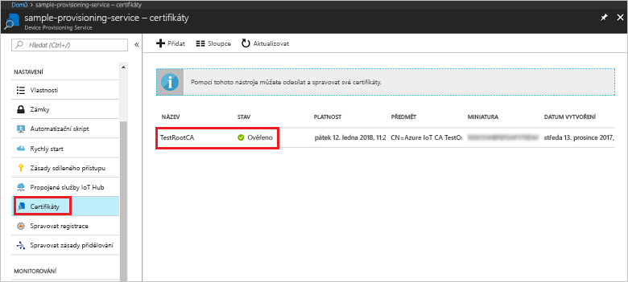
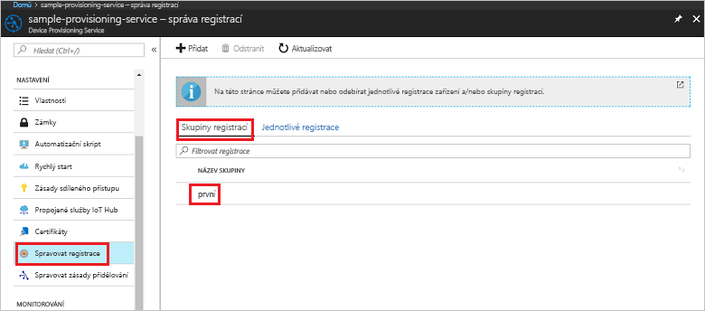

# <a name="quickstart-enroll-x509-devices-to-the-device-provisioning-service-using-nodejs"></a>Rychlý start: Registrace zařízení X.509 do služby Device Provisioning Service pomocí Node.js

[!INCLUDE [iot-dps-selector-quick-enroll-device-x509](../../includes/iot-dps-selector-quick-enroll-device-x509.md)]

V tomto rychlém startu použijete Node. js k programovému vytvoření skupiny registrací, která používá certifikáty X. 509 zprostředkující nebo kořenové certifikační autority. Skupiny registrací se vytvoří pomocí sady SDK IoT pro Node.js a ukázkové aplikace Node.js.

## <a name="prerequisites"></a>Požadavky

- Dokončení [nastavení IoT Hub Device Provisioning Service pomocí Azure Portal](./quick-setup-auto-provision.md).
- Účet Azure s aktivním předplatným. [Vytvořte si ho zdarma](https://azure.microsoft.com/free/?ref=microsoft.com&utm_source=microsoft.com&utm_medium=docs&utm_campaign=visualstudio).
- [Node. js v 4.0 +](https://nodejs.org). V tomto rychlém startu se nainstaluje [Sada IoT SDK pro Node. js](https://github.com/Azure/azure-iot-sdk-node) níže.
- [Git](https://git-scm.com/download/).
- [Sada SDK Azure IoT C](https://github.com/Azure/azure-iot-sdk-c).

## <a name="prepare-test-certificates"></a>Příprava testovacích certifikátů

Pro účely tohoto rychlého startu potřebujete soubor .pem nebo .cer, který obsahuje veřejnou část zprostředkujícího nebo kořenového certifikátu X.509 certifikační autority. Certifikát musí být nahraný do vaší služby zřizování a ověřený touto službou.

Další informace o používání infrastruktury veřejných klíčů (PKI) založené na certifikátech X.509 se službami Azure IoT Hub a Device Provisioning najdete v tématu [Přehled zabezpečení pomocí certifikátu webu X.509](https://docs.microsoft.com/azure/iot-hub/iot-hub-x509ca-overview).

Sada [SDK služby Azure IoT pro jazyk C](https://github.com/Azure/azure-iot-sdk-c) obsahuje testovací nástroje, které vám můžou pomoct vytvořit řetěz certifikátů X.509, nahrát kořenový nebo zprostředkující certifikát z tohoto řetězu a ověřit certifikát testováním vlastnictví pomocí této služby. Certifikáty vytvořené pomocí nástrojů sady SDK jsou určené **jenom k testování během vývoje**. Tyto certifikáty **se nesmí používat v produkčním prostředí**. Obsahují pevně zakódovaná hesla („1234“), jejichž platnost vyprší po 30 dnech. Informace o získání certifikátů vhodných pro použití v produkčním prostředí najdete v tématu věnovaném [získání certifikátu webu X.509](https://docs.microsoft.com/azure/iot-hub/iot-hub-x509ca-overview#how-to-get-an-x509-ca-certificate) v dokumentaci ke službě Azure IoT Hub.

Pokud chcete vygenerovat certifikáty pomocí těchto testovacích nástrojů, proveďte následující kroky:
 
1. Vyhledejte název značky pro [nejnovější verzi](https://github.com/Azure/azure-iot-sdk-c/releases/latest) sady Azure IoT C SDK.

2. Otevřete příkazový řádek nebo prostředí Git Bash a přejděte do pracovní složky na svém počítači. Spuštěním následujících příkazů naklonujte nejnovější verzi úložiště GitHub pro [Azure IoT C SDK](https://github.com/Azure/azure-iot-sdk-c) . Použijte značku, kterou jste našli v předchozím kroku, jako hodnotu `-b` parametru:

    ```cmd/sh
    git clone -b <release-tag> https://github.com/Azure/azure-iot-sdk-c.git
    cd azure-iot-sdk-c
    git submodule update --init
    ```

    Buďte připravení na to, že může trvat i několik minut, než se tato operace dokončí.

   Testovací nástroje se nacházejí ve složce *azure-iot-sdk-c/tools/CACertificates* úložiště, které jste naklonovali.

3. Ukázky a kurzy najdete v článku [Správa testovacích certifikátů certifikační autority](https://github.com/Azure/azure-iot-sdk-c/blob/master/tools/CACertificates/CACertificateOverview.md). 


## <a name="create-the-enrollment-group-sample"></a>Vytvoření ukázky skupiny registrací 

Služba Azure IoT Device Provisioning podporuje dva typy registrací:

- [Skupiny registrací:](concepts-service.md#enrollment-group) Slouží k registraci několika souvisejících zařízení.
- [Jednotlivé registrace](concepts-service.md#individual-enrollment): používá se k registraci jednoho zařízení.

Skupina registrací řídí přístup ke službě zřizování pro zařízení, která ve svém řetězu certifikátů sdílejí společný podpisový certifikát. Další informace najdete v tématu [Řízení přístupu zařízení ke službě zřizování pomocí certifikátů X.509](./concepts-security.md#controlling-device-access-to-the-provisioning-service-with-x509-certificates).
 
1. Z příkazového okna ve vaší pracovní složce spusťte:
  
     ```cmd\sh
     npm install azure-iot-provisioning-service
     ```  

2. Pomocí textového editoru ve své pracovní složce vytvořte soubor **create_enrollment_group.js**. Přidejte do souboru následující kód a uložte ho:

    ```
    'use strict';
    var fs = require('fs');

    var provisioningServiceClient = require('azure-iot-provisioning-service').ProvisioningServiceClient;

    var serviceClient = provisioningServiceClient.fromConnectionString(process.argv[2]);

    var enrollment = {
      enrollmentGroupId: 'first',
      attestation: {
        type: 'x509',
        x509: {
          signingCertificates: {
            primary: {
              certificate: fs.readFileSync(process.argv[3], 'utf-8').toString()
            }
          }
        }
      },
      provisioningStatus: 'disabled'
    };

    serviceClient.createOrUpdateEnrollmentGroup(enrollment, function(err, enrollmentResponse) {
      if (err) {
        console.log('error creating the group enrollment: ' + err);
      } else {
        console.log("enrollment record returned: " + JSON.stringify(enrollmentResponse, null, 2));
        enrollmentResponse.provisioningStatus = 'enabled';
        serviceClient.createOrUpdateEnrollmentGroup(enrollmentResponse, function(err, enrollmentResponse) {
          if (err) {
            console.log('error updating the group enrollment: ' + err);
          } else {
            console.log("updated enrollment record returned: " + JSON.stringify(enrollmentResponse, null, 2));
          }
        });
      }
    });
    ```

## <a name="run-the-enrollment-group-sample"></a>Spuštění ukázky skupiny registrací
 
1. Ke spuštění ukázky potřebujete připojovací řetězec pro vaši službu zřizování. 
    1. Přihlaste se k Azure Portal, v nabídce na levé straně vyberte tlačítko **všechny prostředky** a otevřete svou službu Device Provisioning. 
    2. Klikněte na **zásady sdíleného přístupu**a pak vyberte zásadu přístupu, kterou chcete použít k otevření jejích vlastností. V okně **Zásady přístupu** si zkopírujte a poznamenejte primární připojovací řetězec klíče. 

        


3. Jak se píše v části [Příprava testovacích certifikátů](quick-enroll-device-x509-node.md#prepare-test-certificates), potřebujete také soubor .pem obsahující zprostředkující nebo kořenový certifikát X.509 certifikační autority, který jste předtím nahráli do své služby zřizování a ověřili. Pokud chcete zkontrolovat, jestli je váš certifikát nahraný a ověřený, na stránce Souhrn služby Device Provisioning v Azure Portal vyberte **certifikáty**. Vyhledejte certifikát, který chcete použít pro skupinovou registraci, a ujistěte se, že jeho stav má hodnotu *ověřeno*.

     

1. Pokud chcete pro svůj certifikát vytvořit [skupinu](concepts-service.md#enrollment-group) registrací, spusťte následující příkaz (včetně uvozovek kolem argumentů příkazu):
 
     ```cmd\sh
     node create_enrollment_group.js "<the connection string for your provisioning service>" "<your certificate's .pem file>"
     ```
 
3. Po úspěšném vytvoření se v příkazovém okně zobrazí vlastnosti nové skupiny registrací.

     

4. Ověřte vytvoření skupiny registrací. Na webu Azure Portal v okně s přehledem služby Device Provisioning vyberte **Správa registrací**. Vyberte kartu **Skupiny registrací** a ověřte, jestli obsahuje novou položku registrace (*první*).

     
 
## <a name="clean-up-resources"></a>Vyčištění prostředků
Pokud plánujete prozkoumat ukázky služeb Node. js, neprovádějte čištění prostředků vytvořených v rámci tohoto rychlého startu. Pokud pokračovat nechcete, pomocí následujícího postupu odstraňte všechny prostředky Azure vytvořené tímto rychlým startem.
 
1. Zavřete na svém počítači okno výstupu ukázky v Node.js.
2. Přejděte do vaší služby Device Provisioning v Azure Portal, vyberte **spravovat registrace**a pak vyberte kartu **skupiny** registrací. zaškrtněte políčko vedle *názvu skupiny* pro zařízení X. 509, které jste zaregistrovali v rámci tohoto rychlého startu, a klikněte na tlačítko **Odstranit** v horní části podokna.    
3. V Azure Portal ve vaší službě Device Provisioning vyberte **certifikáty**, vyberte certifikát, který jste nahráli pro tento rychlý Start, a stiskněte tlačítko **Odstranit** v horní části okna **Podrobnosti o certifikátu** .  
 
## <a name="next-steps"></a>Další kroky

V tomto rychlém startu jste vytvořili registraci skupin pro certifikát X. 509 zprostředkující nebo kořenové certifikační autority pomocí IoT Hub Device Provisioning Service Azure. Pokud se chcete se zřizováním zařízení seznámit podrobněji, pokračujte ke kurzu nastavení služby Device Provisioning na webu Azure Portal. 

Podívejte se také na [ukázku zřizování zařízení Node. js](https://github.com/Azure/azure-iot-sdk-node/tree/master/provisioning/device/samples).
 
> [!div class="nextstepaction"]
> [Kurzy pro službu Azure IoT Hub Device Provisioning](./tutorial-set-up-cloud.md)
