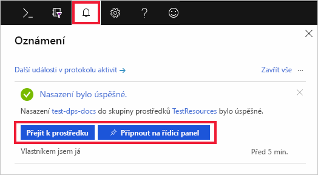

# Nastavení služby Azure IoT Hub Device Provisioning pomocí webu Azure Portal

Tyto kroky ukazují, jak na portálu nastavit cloudové prostředky Azure pro zřizování zařízení. Tento článek obsahuje kroky pro vytvoření služby IoT Hub, vytvoření nové služby IoT Hub Device Provisioning a jejich propojení. 

Pokud ještě nemáte předplatné Azure, vytvořte si [bezplatný účet](https://azure.microsoft.com/free/?WT.mc_id=A261C142F) před tím, než začnete.

## Vytvoření centra IoT

[!INCLUDE [iot-hub-include-create-hub](../../includes/iot-hub-include-create-hub.md)]

## Vytvoření nové instance služby IoT Hub Device Provisioning

1. Klikněte na tlačítko **Vytvořit prostředek** v levém horním rohu webu Azure Portal.

2. *V Marketplace vyhledejte* **službu Device Provisioning**. Vyberte **Služba IoT Hub Device Provisioning** a klikněte na tlačítko **Vytvořit**. 

3. Zadejte následující informace pro vaši novou instanci služby Device Provisioning a klikněte na **Vytvořit**.

    * **Jméno:** Zadejte jedinečný název pro novou instanci služby Device Provisioning. Pokud je zadaný název platný, zobrazí se zelený symbol zaškrtnutí.
    * **Předplatné:** Zvolte předplatné, které chcete použít k vytvoření této instance služby Device Provisioning.
    * **Skupina prostředků:** Toto pole můžete vytvořit novou skupinu prostředků nebo vyberte existující tak, aby obsahovala nové instance. Zvolte stejnou skupinu prostředků, kterou jste vytvořili výše a obsahuje IoT Hub, například **TestResources**. Když umístíte všechny související prostředky do jedné skupiny, můžete je spravovat společně. Například odstraněním skupiny prostředků se odstraní všechny prostředky, které tato skupina obsahuje. Další informace najdete v tématu [skupiny prostředků spravovat Azure Resource Manageru](../azure-resource-manager/manage-resource-groups-portal.md).
    * **Umístění:** Vyberte nejbližší umístění pro vaše zařízení.

        

4. Pokud chcete monitorovat vytváření instance prostředku, klikněte na tlačítko oznámení. Po úspěšném nasazení služby klikněte na **Připnout na řídicí panel** a pak na **Přejít k prostředku**.

    

## Propojení centra IoT a služby Device Provisioning

V této části přidáte konfiguraci do instance služby Device Provisioning. Tato konfigurace nastaví službu IoT Hub, pro kterou jsou zařízení zřízená.

1. Klikněte na tlačítko **Všechny prostředky** v nabídce vlevo na webu Azure Portal. Vyberte instanci služby Device Provisioning, kterou jste vytvořili v předchozí části.  

2. V okně s přehledem služby Device Provisioning vyberte **Propojená centra IoT**. Klikněte na tlačítko **+ Přidat** v horní části. 

3. Na stránce **Přidat propojení s centrem IoT** zadejte následující informace, abyste propojili vaši novou instanci služby Device Provisioning s centrem IoT. Potom klikněte na **Uložit**. 

    * **Předplatné:** Vyberte předplatné obsahující služby IoT hub, který chcete propojit s novou instanci služby Device Provisioning.
    * **Služby IOT hub:** Vyberte službu IoT hub k propojení s novou instanci služby Device Provisioning.
    * **Zásady přístupu:** Vyberte **iothubowner** jako přihlašovací údaje pro vytvoření propojení s centrem IoT.  

        

3. Vybrané centrum by se teď mělo zobrazit v okně **Propojená centra IoT**. Možná budete muset kliknout na tlačítko **Aktualizovat**, aby se okno **Propojená centra IoT Hub** zobrazilo.

## Vyčištění prostředků

Další rychlé starty v této kolekci jsou postavené na tomto rychlém startu. Pokud chcete pokračovat v práci s dalšími rychlými starty nebo kurzy, nevyčišťujte prostředky vytvořené v rámci tohoto rychlého startu. Pokud pokračovat nechcete, pomocí následujících kroků odstraňte všechny prostředky vytvořené tímto rychlým startem na webu Azure Portal.

1. V nabídce vlevo na webu Azure Portal klikněte na **Všechny prostředky** a vyberte svou službu Device Provisioning. V horní části okna **Všechny prostředky** klikněte na **Odstranit**.  
2. V nabídce vlevo na webu Azure Portal klikněte na **Všechny prostředky** a vyberte své centrum IoT. V horní části okna **Všechny prostředky** klikněte na **Odstranit**.  

## Další postup

V tomto rychlém startu jste nasadili centrum IoT a instanci služby Device Provisioning a propojili jste tyto dva prostředky. Pokud chcete zjistit, jak pomocí tohoto nastavení zřídit simulované zařízení, pokračujte k rychlému startu pro vytvoření simulovaného zařízení.

> [!div class="nextstepaction"]
> [Rychlý start k vytvoření simulovaného zařízení](./quick-create-simulated-device.md)
