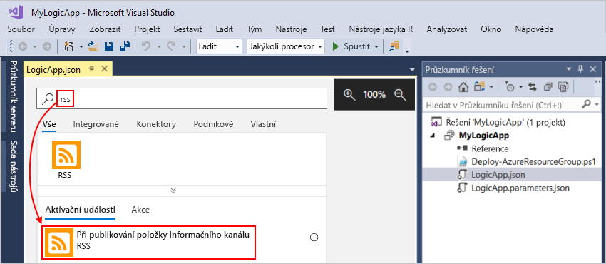
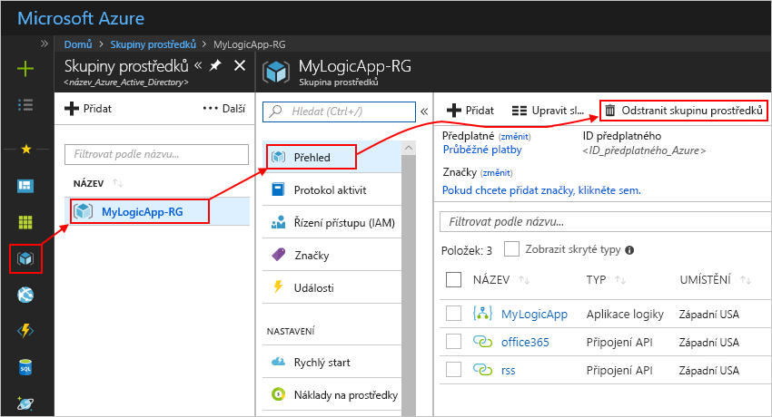

# Rychlý Start: vytvoření automatizovaných úloh, procesů a pracovních postupů pomocí Azure Logic Apps – Visual Studio

Pomocí [Azure Logic Apps](../logic-apps/logic-apps-overview.md) a sady Visual Studio můžete vytvářet pracovní postupy automatizující úlohy a procesy pro integraci aplikací, dat, systémů a služeb napříč podniky a organizacemi. V tomto rychlém startu se dozvíte, jak můžete navrhovat a sestavovat tyto pracovní postupy vytvořením Logic Apps v aplikaci Visual Studio a nasazením těchto aplikací do Azure. I když můžete provádět tyto úlohy v Azure Portal, Visual Studio umožňuje přidat vaše aplikace logiky do správy zdrojových kódů, publikovat různé verze a vytvářet Azure Resource Manager šablony pro různá prostředí nasazení.

Pokud s Azure Logic Apps teprve začínáte a chcete jenom základní koncepty, vyzkoušejte si [rychlý Start pro vytvoření aplikace logiky v Azure Portal](../logic-apps/quickstart-create-first-logic-app-workflow.md). Návrhář aplikace logiky funguje podobně jak v Azure Portal, tak i v sadě Visual Studio.

V tomto rychlém startu vytvoříte stejnou aplikaci logiky pomocí sady Visual Studio jako rychlý Start Azure Portal. Tato aplikace logiky monitoruje informační kanál RSS webu a odesílá e-maily pro každou novou položku v tomto informačním kanálu. Vaše dokončená aplikace logiky bude vypadat jako tento pracovní postup vysoké úrovně:

## Předpoklady

* Předplatné Azure. Pokud nemáte předplatné Azure, [zaregistrujte si bezplatný účet Azure](https://azure.microsoft.com/free/).

* Pokud je ještě nemáte, stáhněte a nainstalujte tyto nástroje:

  * [Visual Studio 2019, 2017 nebo 2015 – Community Edition nebo vyšší](https://aka.ms/download-visual-studio). 
  V tomto rychlém startu se používá Visual Studio Community 2017.

    > [!IMPORTANT]
    > Když nainstalujete Visual Studio 2019 nebo 2017, ujistěte se, že jste vybrali úlohu **vývoj pro Azure** .

  * [Microsoft Azure SDK pro .NET (2.9.1 nebo novější)](https://azure.microsoft.com/downloads/). 
  Další informace o sadě [Azure SDK pro .NET](https://docs.microsoft.com/dotnet/azure/dotnet-tools?view=azure-dotnet).

  * [Azure PowerShell](https://github.com/Azure/azure-powershell#installation)

  * Azure Logic Apps nástroje pro verzi sady Visual Studio, kterou chcete:

    * [Visual Studio 2019](https://aka.ms/download-azure-logic-apps-tools-visual-studio-2019)

    * [Visual Studio 2017](https://aka.ms/download-azure-logic-apps-tools-visual-studio-2017)

    * [Visual Studio 2015](https://aka.ms/download-azure-logic-apps-tools-visual-studio-2015)
  
    Azure Logic Apps Tools můžete stáhnout a nainstalovat přímo z Visual Studio Marketplace nebo si můžete přečíst, [jak toto rozšíření nainstalovat v rámci sady Visual Studio](https://docs.microsoft.com/visualstudio/ide/finding-and-using-visual-studio-extensions). 
    Po dokončení instalace nezapomeňte sadu Visual Studio restartovat.

* Pokud chcete pracovat s různými prostředími Azure, jako je například Azure Government, můžete nainstalovat a používat rozšíření pro [Výběr prostředí Azure](https://marketplace.visualstudio.com/items?itemName=SteveMichelotti.AzureEnvironmentSelector) , které vám pomůže snadněji přepínat mezi prostředími. Další informace najdete v tématu [představení rozšíření sady Visual Studio pro selektor prostředí Azure](https://devblogs.microsoft.com/azuregov/introducing-the-azure-environment-selector-visual-studio-extension/).

* Přístup k webu při používání vloženého Návrháře aplikace logiky

  Návrhář potřebuje připojení k Internetu, aby mohl vytvářet prostředky v Azure a číst vlastnosti a data z konektorů ve vaší aplikaci logiky. 
  Například pro připojení Dynamics CRM Online Návrhář kontroluje vaši instanci CRM na výchozí a vlastní vlastnosti.

* E-mailový účet podporovaný v Logic Apps, jako je Office 365 Outlook, Outlook.com nebo Gmail. Pokud máte jiného poskytovatele, [tady se podívejte na seznam konektorů](https://docs.microsoft.com/connectors/). V tomto příkladu se používá Office 365 Outlook. Pokud použijete jiného poskytovatele, celkový postup bude stejný, ale vaše uživatelské rozhraní se může mírně lišit.

## Vytvoření projektu skupiny prostředků Azure

Začněte vytvořením [projektu skupiny prostředků Azure](../azure-resource-manager/vs-azure-tools-resource-groups-deployment-projects-create-deploy.md). Další informace o [skupinách prostředků a prostředcích Azure](../azure-resource-manager/resource-group-overview.md).

1. Spusťte Visual Studio. Přihlaste se pomocí svého účtu Azure.

1. V nabídce **Soubor** vyberte **Nový** > **Projekt**. (Klávesová zkratka: Ctrl + Shift + N)

   

1. V části **Nainstalováno**, vyberte **Visual C#** nebo **Visual Basic**. Vyberte **Cloud** > **Skupina prostředků Azure**. Pojmenujte svůj projekt, například:

   

   > [!NOTE]
   > Názvy skupin prostředků můžou obsahovat jenom písmena, číslice, tečky (`.`), podtržítka (`_`), spojovníky (`-`) a kulaté závorky (`(`, `)`), ale nemůžou *končit* tečkami (`.`).
   >
   > Pokud se **Cloud** nebo **Skupina prostředků Azure** nezobrazí, ujistěte se, že jste nainstalovali sadu Azure SDK pro Visual Studio.

   Pokud používáte Visual Studio 2019, postupujte podle následujících kroků:

   1. V poli **vytvořit nový projekt** vyberte projekt **skupiny prostředků Azure** pro Visual C# nebo Visual Basic. Zvolte **Další**.

   1. Zadejte název skupiny prostředků Azure, kterou chcete použít, a další informace o projektu. Zvolte **Vytvořit**.

1. V seznamu šablon vyberte šablonu **Aplikace logiky** . Zvolte **OK**.

   

   Jakmile sada Visual Studio vytvoří projekt, otevře se Průzkumník řešení, ve kterém se zobrazí vaše řešení. 
   Ve vašem řešení soubor **LogicApp. JSON** nejen ukládá definici aplikace logiky, ale je také šablonou Azure Resource Manager, kterou můžete použít pro nasazení.

   

## Vytvoření prázdné aplikace logiky

Když máte projekt skupiny prostředků Azure, vytvořte aplikaci logiky pomocí **prázdné šablony aplikace logiky** .

1. V Průzkumník řešení otevřete místní nabídku souboru **LogicApp. JSON** . Vyberte **Otevřít pomocí Návrháře aplikace logiky**. (Klávesová zkratka: Ctrl + L)

   

   > [!TIP]
   > Pokud tento příkaz v aplikaci Visual Studio 2019 nemáte, ověřte, že máte nejnovější aktualizace pro Visual Studio.

   Visual Studio vás vyzve k zadání předplatného Azure a skupiny prostředků Azure pro vytváření a nasazování prostředků pro vaši aplikaci logiky a připojení.

1. Jako **předplatné**vyberte své předplatné Azure. V případě **skupiny prostředků**vyberte **vytvořit novou** a vytvořte novou skupinu prostředků Azure.

   

   | Nastavení | Příklad hodnoty | Popis |
   | ------- | ------------- | ----------- |
   | Výpis profilu uživatele | Contoso   jamalhartnett@contoso.com | Ve výchozím nastavení se jedná o účet, který jste použili k přihlášení |
   | **Předplatné** | Průběžné platby   (jamalhartnett@contoso.com) | Název vašeho předplatného Azure a přidruženého účtu |
   | **Skupina prostředků** | MyLogicApp-RG   (Západní USA) | Skupina prostředků Azure a umístění pro ukládání a nasazování prostředků vaší aplikace logiky |
   | **Umístění** | MyLogicApp-RG2   (Západní USA) | Jiné umístění, pokud nechcete použít umístění skupiny prostředků |
   ||||

1. Návrhář Logic Apps otevře stránku se zobrazeným úvodním videem a běžně používanými triggery. Posuňte se dolů za video a triggery do **šablon**a vyberte **prázdná aplikace logiky**.

   

## Sestavení pracovního postupu aplikace logiky

Dále přidejte [aktivační událost](../logic-apps/logic-apps-overview.md#logic-app-concepts) RSS, která se aktivuje při zobrazení nové položky informačního kanálu. Každá aplikace logiky se spouští triggerem, který se aktivuje při splnění určitých kritérií. Pokaždé, když se trigger aktivuje, vytvoří modul Logic Apps instanci aplikace logiky pro spuštění vašeho pracovního postupu.

1. V návrháři aplikace logiky pod vyhledávacím polem vyberte **vše**.
Do vyhledávacího pole zadejte "RSS". V seznamu triggery vyberte tuto aktivační událost: **když je publikovaná položka informačního kanálu – RSS**

   

1. Po zobrazení triggeru v Návrháři dokončete vytváření aplikace logiky pomocí kroků pracovního postupu v [rychlém startu Azure Portal](../logic-apps/quickstart-create-first-logic-app-workflow.md#add-rss-trigger)a pak se vraťte k tomuto článku. Jakmile budete hotovi, vaše aplikace logiky bude vypadat jako v tomto příkladu:

   

1. Uložte řešení sady Visual Studio. (Klávesová zkratka: Ctrl + S)

## Nasazení aplikace logiky do Azure

Předtím, než budete moci spustit a otestovat aplikaci logiky, nasaďte aplikaci do Azure ze sady Visual Studio.

1. V Průzkumníku řešení v místní nabídce vašeho projektu vyberte **Nasadit** > **Nový**. Pokud se zobrazí výzva, přihlaste se pomocí svého účtu Azure.

   

1. Pro toto nasazení ponechte výchozí předplatné Azure, skupinu prostředků a další nastavení. Vyberte **nasadit**.

   

1. Pokud se zobrazí pole **Upravit parametry** , zadejte název prostředku aplikace logiky. Uložte nastavení.

   

   Po zahájení nasazování se v okně **Výstup** sady Visual Studio zobrazí stav nasazení vaší aplikace. Pokud se stav nezobrazí, otevřete seznam **Zobrazit výstup z** a vyberte svou skupinu prostředků Azure.

   

   Pokud vaše vybrané konektory potřebují vstup z vaší aplikace, otevře se okno PowerShellu na pozadí a zobrazí se výzva k zadání potřebných hesel nebo tajných klíčů. Po zadání těchto informací bude nasazení pokračovat.

   

   Po dokončení nasazení vaše aplikace logiky bude v Azure Portal živá a spustí se podle zadaného plánu (každou minutu). Pokud aktivační událost najde nové položky informačního kanálu, aktivuje se Trigger, který vytvoří instanci pracovního postupu, která spustí akce aplikace logiky. Vaše aplikace logiky posílá e-mail pro každou novou položku. V opačném případě, pokud aktivační procedura nenajde nové položky, aktivační událost se neaktivuje a "přeskočí" vytváření instancí pracovního postupu. Vaše aplikace logiky počká do dalšího intervalu před kontrolou.

   Tady jsou ukázkové e-maily, které tato aplikace logiky posílá. 
   Pokud neobdržíte žádné e-maily, zkontrolujte složku s nevyžádanými e-maily.

   

Gratulujeme, úspěšně jste vytvořili a nasadili aplikaci logiky pomocí sady Visual Studio. Informace o správě aplikace logiky a kontrole historie jejího spuštění najdete v tématu [Správa aplikací logiky s využitím sady Visual Studio](../logic-apps/manage-logic-apps-with-visual-studio.md).

## Přidat novou aplikaci logiky

Pokud máte existující projekt skupiny prostředků Azure, můžete do tohoto projektu přidat novou prázdnou aplikaci logiky pomocí okna osnova JSON.

1. V Průzkumník řešení otevřete soubor `<logic-app-name>.json`.

1. V nabídce **zobrazení** vyberte jiné @no__t **Windows**-2 –**Osnova JSON**.

1. Chcete-li přidat prostředek do souboru šablony, vyberte možnost **Přidat prostředek** v horní části okna osnovy JSON. V okně Osnova JSON klikněte pravým tlačítkem na **prostředky**a vyberte **Přidat nový prostředek**.

   

1. V dialogovém okně **Přidat prostředek** Najděte a vyberte **Aplikace logiky**. Pojmenujte aplikaci logiky a klikněte na tlačítko **Přidat**.

   

## Vyčištění prostředků

Až budete s aplikací logiky hotovi, odstraňte skupinu prostředků, která obsahuje vaši aplikaci logiky a související prostředky.

1. Přihlaste se k webu [Azure Portal](https://portal.azure.com) pomocí stejného účtu, který jste použili k vytvoření své aplikace logiky.

1. V hlavní nabídce Azure vyberte **Skupiny prostředků**.
Vyberte skupinu prostředků vaší aplikace logiky a vyberte **Přehled**.

1. Na stránce **Přehled** zvolte **Odstranit skupinu prostředků**. Pro ověření zadejte název skupiny prostředků a zvolte **Odstranit**.

   

1. Odstraňte řešení sady Visual Studio ze svého místního počítače.

## Další kroky

V tomto článku jste pomocí sady Visual Studio sestavili, nasadili a spustili aplikaci logiky. Další informace o správě a provádění pokročilého nasazení Logic Apps se sadou Visual Studio najdete v těchto článcích:

> [!div class="nextstepaction"]
> * [Správa aplikací logiky s využitím sady Visual Studio](../logic-apps/manage-logic-apps-with-visual-studio.md)
