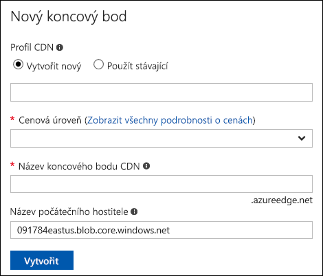

# Integrace statického webu s Azure CDN

Síť [pro doručování obsahu Azure (CDN)](../../cdn/cdn-overview.md) můžete povolit ukládání obsahu ze [statického webu,](storage-blob-static-website.md) který je hostovaný v účtu úložiště Azure. Azure CDN můžete použít ke konfiguraci vlastního koncového bodu domény pro statický web, zřízení vlastních certifikátů TLS/SSL a konfiguraci vlastních pravidel přepisování. Konfigurace Azure CDN má za následek další poplatky, ale poskytuje konzistentní nízké latence na vašem webu z libovolného místa na světě. Azure CDN také poskytuje šifrování TLS s vlastním certifikátem. 

Informace o cenách Azure CDN najdete v tématu [Azure CDN pricing](https://azure.microsoft.com/pricing/details/cdn/).

## Povolení Azure CDN pro statický web

Azure CDN pro statický web můžete povolit přímo z účtu úložiště. Pokud chcete pro koncový bod CDN specifikovat pokročilá nastavení konfigurace, jako je například [optimalizaci stahování velkých souborů](../../cdn/cdn-optimization-overview.md#large-file-download), můžete místo toho použít [rozšíření Azure CDN](../../cdn/cdn-create-new-endpoint.md) a vytvořit profil CDN a koncový bod.

1. Vyhledejte svůj účet úložiště na webu Azure Portal a zobrazte přehled účtu.

2. V nabídce **Služby blob** vyberte **Azure CDN** a nakonfigurujte Azure CDN.

    Zobrazí se stránka **Azure CDN**.

    

3. V části **profilu CDN** zadejte nový nebo existující profil CDN. 

4. Zadejte cenovou úroveň pro koncový bod CDN. Další informace o cenách najdete v [tématu Ceny v síti pro doručování obsahu](https://azure.microsoft.com/pricing/details/cdn/). Další informace o funkcích dostupných pro každou vrstvu najdete [v tématu Porovnání funkcí produktu Azure CDN](../../cdn/cdn-features.md).

5. Do pole **názvu koncového bodu CDN** zadejte název koncového bodu CDN. Koncový bod CDN musí být jedinečný v rámci Azure.

6. Určete, že jste statický koncový bod webu v poli **Origin hostname.** 

   Chcete-li najít koncový bod statického webu, přejděte k nastavení **statického webu** pro váš účet úložiště.  Zkopírujte primární koncový bod a vložte jej do konfigurace CDN.

   > [!IMPORTANT]
   > Nezapomeňte odebrat identifikátor protokolu *(např.* HTTPS) a koncové lomítko v adrese URL. Pokud je `https://mystorageaccount.z5.web.core.windows.net/`například statický koncový bod webu `mystorageaccount.z5.web.core.windows.net` , určíte jej v poli **Origin hostname.**

   Následující obrázek znázorňuje ukázkovou konfiguraci koncového bodu:

   

7. Vyberte **Vytvořit**a počkejte, až se rozšíří. Koncový bod se po vytvoření zobrazí v seznamu koncových bodů.

8. Chcete-li ověřit, zda je koncový bod CDN správně nakonfigurován, přejděte na jeho nastavení klepnutím na koncový bod. V přehledu CDN pro váš účet úložiště vyhledejte název hostitele koncového bodu a přejděte na koncový bod, jak je znázorněno na následujícím obrázku. Formát koncového bodu CDN bude `https://staticwebsitesamples.azureedge.net`podobný .

    

9. Po dokončení šíření koncového bodu CDN se při přechodu na koncový bod CDN zobrazí obsah souboru index.html, který jste dříve nahráli na statický web.

10. Chcete-li zkontrolovat nastavení původu koncového bodu CDN, přejděte na **Origin** v části **Nastavení** koncového bodu CDN. Uvidíte, že pole **Typ původu** je nastaveno na *vlastní původ* a že pole Název **hostitele Origin** zobrazuje koncový bod vašeho statického webu.

    

## Odebrání obsahu z Azure CDN

Pokud už nechcete objekt v Azure CDN ukládat do mezipaměti, můžete použít některý z následujících kroků:

* Nastavte kontejner jako privátní, nikoli veřejný. Další informace naleznete v [tématu Správa anonymního přístupu pro čtení ke kontejnerům a objektům BLOB](storage-manage-access-to-resources.md).
* Zakažte nebo odstraňte koncový bod CDN pomocí webu Azure Portal.
* Upravte hostovanou službu tak, aby už nereagovala na žádosti tohoto objektu.

Objekt, který už je v mezipaměti v Azure CDN uložený, tam zůstane uložený, dokud neuplyne období TTL (Time-To-Live) objektu nebo dokud se koncový bod [nevyprázdní](../../cdn/cdn-purge-endpoint.md). Když uplyne období TTL, Azure CDN určí, jestli je koncový bod stále platný a jestli je objekt stále anonymně přístupný. Pokud tomu tak není, objekt se už v mezipaměti ukládat nebude.

## Další kroky

(Nepovinné) Přidejte vlastní doménu do koncového bodu Azure CDN. Viz [kurz: Přidání vlastní domény do koncového bodu Azure CDN](../../cdn/cdn-map-content-to-custom-domain.md).
