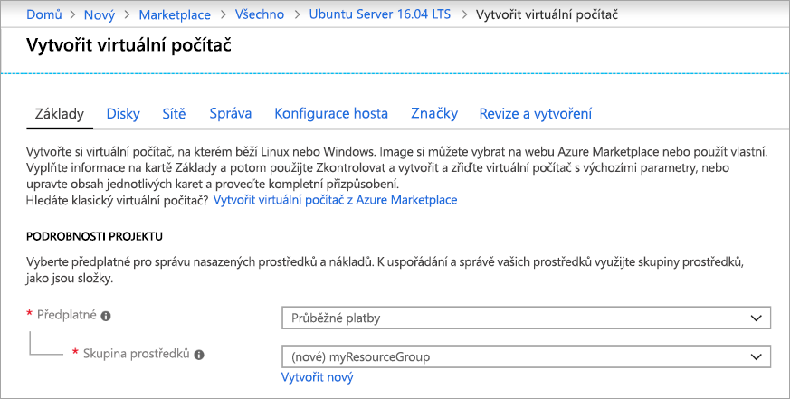

# <a name="quickstart-create-a-linux-virtual-machine-in-the-azure-portal"></a>Rychlý start: Vytvoření virtuálního počítače s Linuxem na webu Azure Portal

Virtuální počítače Azure je možné vytvářet na webu Azure Portal. Azure Portal je uživatelské rozhraní založené na prohlížeči pro vytváření prostředků Azure. V tomto rychlém startu se dozvíte, jak použít Azure Portal k nasazení virtuálního počítače se systémem Linux se systémem Ubuntu 18,04 LTS. Také se k virtuálnímu počítači připojíte přes SSH a nainstalujete na něj webový server NGINX, abyste virtuální počítač viděli v akci.

Pokud ještě nemáte předplatné Azure, vytvořte si [bezplatný účet](https://azure.microsoft.com/free/?WT.mc_id=A261C142F) před tím, než začnete.

## <a name="create-ssh-key-pair"></a>Vytvoření páru klíčů SSH

K dokončení tohoto rychlého startu potřebujete pár klíčů SSH. Pokud už máte pár klíčů SSH, můžete tento krok přeskočit.

Otevřete prostředí Bash a pomocí nástroje [ssh-keygen](https://www.ssh.com/ssh/keygen/) vytvořte pár klíčů SSH. Pokud na místním počítači nemáte prostředí Bash, můžete použít [Azure Cloud Shell](https://shell.azure.com/bash).


1. Přihlásit se na [Azure Portal](https://portal.azure.com).
1. V nabídce v horní části stránky vyberte ikonu `>_` pro otevření Cloud Shell.
1. Ujistěte se, že Cloudshellu říká **bash** v levém horním rohu. Pokud se jedná o PowerShell, vyberte v rozevíracím seznamu **bash** a vyberte **Potvrdit** pro změnu prostředí bash shell.
1. Zadejte `ssh-keygen -t rsa -b 2048` pro vytvoření klíče SSH. 
1. Zobrazí se výzva k zadání souboru, do kterého chcete uložit dvojici klíčů. Stačí stisknout **ENTER** a uložit ve výchozím umístění, které je uvedené v závorkách. 
1. Zobrazí se výzva k zadání hesla. Pro svůj klíč SSH můžete zadat přístupové heslo nebo stisknutím klávesy **ENTER** pokračovat bez hesla.
1. Příkaz `ssh-keygen` generuje veřejné a privátní klíče s výchozím názvem `id_rsa` v `~/.ssh directory`. Příkaz vrátí úplnou cestu k veřejnému klíči. Použijte cestu k veřejnému klíči k zobrazení jejího obsahu pomocí `cat` zadáním `cat ~/.ssh/id_rsa.pub`.
1. Zkopírujte výstup tohoto příkazu a uložte ho někam pro pozdější použití v tomto článku. Toto je váš veřejný klíč a budete ho potřebovat při konfiguraci účtu správce pro přihlášení k vašemu VIRTUÁLNÍmu počítači.

## <a name="sign-in-to-azure"></a>Přihlášení k Azure

Pokud jste to ještě neudělali, přihlaste se k [Azure Portal](https://portal.azure.com) .

## <a name="create-virtual-machine"></a>Vytvoření virtuálního počítače

1. Do vyhledávacího pole zadejte **virtuální počítače** .
1. V části **služby**vyberte **virtuální počítače**.
1. Na stránce **virtuální počítače** vyberte **Přidat**. Otevře se stránka **vytvořit virtuální počítač** .
1. Přesvědčte se, že je na kartě **Základy** v části **Podrobnosti o projektu** vybrané správné předplatné a pak ve Skupině prostředků vyberte **Vytvořit nový**. Jako název zadejte *myResourceGroup* . *. 

    

1. V části **Podrobnosti o instanci**zadejte *MyVM* pro **název virtuálního počítače**, vyberte *východní USA* pro vaši **oblast**a jako **Obrázek**vyberte *Ubuntu 18,04 LTS* . Zbytek ponechte ve výchozím nastavení.

    

1. V části **účet správce**vyberte **veřejný klíč SSH**, zadejte své uživatelské jméno a pak vložte svůj veřejný klíč. Ve veřejném klíči odeberte počáteční a koncové prázdné znaky.

    

1. V části **Pravidla portů pro příchozí spojení** > **Veřejné příchozí porty** zvolte **Povolit vybrané porty** a potom z rozevíracího seznamu vyberte **SSH (22)** a **HTTP (80)** . 

    

1. Zbytek ponechte ve výchozím nastavení a potom v dolní části stránky vyberte tlačítko **Zkontrolovat a vytvořit**.

1. Na stránce **Vytvoření virtuálního počítače** se zobrazí podrobnosti o virtuálním počítači, který se chystáte vytvořit. Až budete připraveni, vyberte **Vytvořit**.

Nasazení virtuálního počítače bude několik minut trvat. Po dokončení nasazení se přesuňte k další části.

    
## <a name="connect-to-virtual-machine"></a>Připojení k virtuálnímu počítači

Vytvořte připojení SSH k virtuálnímu počítači.

1. Na stránce Přehled pro váš virtuální počítač vyberte tlačítko **Připojit**. 

    

2. Na stránce **Připojení k virtuálnímu počítači** ponechte výchozí výběr možností pro připojení podle IP adresy přes port 22. V části **Přihlásit pomocí místního účtu virtuálního počítače** se zobrazí příkaz pro připojení. Vyberte tlačítko pro zkopírování příkazu. Následující příklad ukazuje, jak vypadá příkaz pro připojení přes SSH:

    ```bash
    ssh azureuser@10.111.12.123
    ```

3. Pomocí stejného prostředí bash, které jste použili k vytvoření páru klíčů SSH (můžete znovu otevřít Cloud Shell tak, že znovu vyberete `>_` nebo https://shell.azure.com/bash)ete, vložíte do prostředí příkaz připojení SSH a vytvoříte relaci SSH.

## <a name="install-web-server"></a>Instalace webového serveru

Pokud se chcete podívat na virtuální počítač v akci, nainstalujte webový server NGINX. V relaci SSH aktualizujte zdroje balíčku a pak nainstalujte nejnovější balíček NGINX.

```bash
sudo apt-get -y update
sudo apt-get -y install nginx
```

Až budete hotovi, zadáním příkazu `exit` ukončete relaci SSH.


## <a name="view-the-web-server-in-action"></a>Zobrazení webového serveru v akci

V libovolném webovém prohlížeči zobrazte výchozí úvodní stránku serveru NGINX. Jako webovou adresu zadejte veřejnou IP adresu virtuálního počítače. Veřejnou IP adresu najdete na stránce přehledu virtuálního počítače nebo v připojovacím řetězci SSH, který jste použili dříve.


## <a name="clean-up-resources"></a>Vyčištění prostředků

Pokud už je nepotřebujete, můžete odstranit skupinu prostředků, virtuální počítač a všechny související prostředky. Provedete to tak, že vyberete skupinu prostředků pro příslušný virtuální počítač, vyberete **Odstranit** a pak potvrdíte název skupiny prostředků, kterou chcete odstranit.

## <a name="next-steps"></a>Další kroky

V tomto rychlém startu jste nasadili jednoduchý virtuální počítač, vytvořili jste skupinu zabezpečení sítě a pravidlo a nainstalovali jste základní webový server. Další informace o virtuálních počítačích Azure najdete v kurzu pro virtuální počítače s Linuxem.

> [!div class="nextstepaction"]
> [Kurzy pro virtuální počítače Azure s Linuxem](./tutorial-manage-vm.md)
