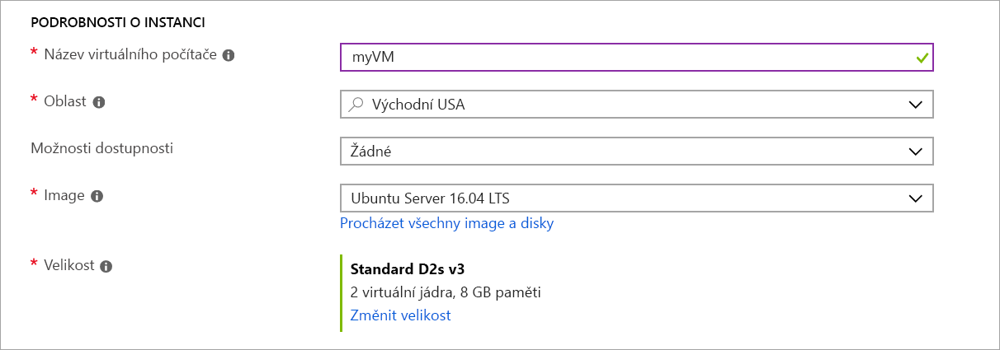

# <a name="quickstart-create-a-linux-virtual-machine-in-the-azure-portal"></a>Rychlý start: Vytvoření virtuálního počítače s Linuxem na webu Azure Portal

Virtuální počítače Azure je možné vytvářet na webu Azure Portal. Portál Azure je uživatelské rozhraní založené na prohlížeči pro vytváření prostředků Azure. Tento rychlý start ukazuje, jak používat portál Azure k nasazení virtuálního počítače (VM) Linuxu se systémem Ubuntu 18.04 LTS. Také se k virtuálnímu počítači připojíte přes SSH a nainstalujete na něj webový server NGINX, abyste virtuální počítač viděli v akci.

Pokud nemáte předplatné Azure, vytvořte si [bezplatný účet,](https://azure.microsoft.com/free/?WT.mc_id=A261C142F) než začnete.

## <a name="create-ssh-key-pair"></a>Vytvoření páru klíčů SSH

K dokončení tohoto rychlého startu potřebujete pár klíčů SSH. Pokud už máte pár klíčů SSH, můžete tento krok přeskočit.

Otevřete prostředí Bash a pomocí nástroje [ssh-keygen](https://www.ssh.com/ssh/keygen/) vytvořte pár klíčů SSH. Pokud na místním počítači nemáte prostředí Bash, můžete použít [Azure Cloud Shell](https://shell.azure.com/bash).


1. Přihlaste se k webu [Azure Portal](https://portal.azure.com).
1. V nabídce v horní části stránky `>_` vyberte ikonu pro otevření Cloud Shellu.
1. Ujistěte se, že CloudShell říká **Bash** v levém horním rohu. Pokud je tam napsáno PowerShell, v rozevíracím souboru vyberte **Bash** a vyberte **Potvrdit,** chcete-li změnit prostředí Bash.
1. Chcete-li vytvořit klíč ssh, zadejte. `ssh-keygen -t rsa -b 2048` 
1. Budete vyzváni k zadání souboru, do kterého chcete uložit dvojici klíčů. Stačí stisknout **klávesu Enter** a uložit se do výchozího umístění uvedeného v závorkách. 
1. Budete vyzváni k zadání přístupové fráze. Můžete zadat přístupové heslo pro klávesu SSH nebo můžete pokračovat bez přístupové fráze stisknutím **klávesy Enter.**
1. Příkaz `ssh-keygen` generuje veřejné a soukromé klíče s `id_rsa` výchozím `~/.ssh directory`názvem v . Příkaz vrátí úplnou cestu k veřejnému klíči. Pomocí cesty k veřejnému klíči `cat` můžete zobrazit `cat ~/.ssh/id_rsa.pub`jeho obsah zadáním .
1. Zkopírujte výstup tohoto příkazu a uložte jej někam použít později v tomto článku. Toto je váš veřejný klíč a budete ho potřebovat při konfiguraci účtu správce pro přihlášení k virtuálnímu počítači.

## <a name="sign-in-to-azure"></a>Přihlášení k Azure

Pokud jste to ještě neudělali, přihlaste se na [portál Azure.](https://portal.azure.com)

## <a name="create-virtual-machine"></a>Vytvoření virtuálního počítače

1. Do hledání zadejte **virtuální počítače.**
1. V části **Služby**vyberte **Virtuální počítače**.
1. Na stránce **Virtuální počítače** vyberte **Přidat**. Otevře se stránka **Vytvořit virtuální počítač.**
1. Přesvědčte se, že je na kartě **Základy** v části **Podrobnosti o projektu** vybrané správné předplatné a pak ve Skupině prostředků vyberte **Vytvořit nový**. Zadejte *název myResourceGroup.*.* 

    

1. V **části Podrobnosti instance**zadejte *myVM* pro název **virtuálního počítače**, zvolte Východní *USA* pro vaši **oblast**a zvolte *Ubuntu 18.04 LTS* pro váš **obrázek**. Zbytek ponechte ve výchozím nastavení.

    

1. V části **Účet správce**vyberte veřejný **klíč SSH**, zadejte své uživatelské jméno a vložte do veřejného klíče. Ve veřejném klíči odeberte počáteční a koncové prázdné znaky.

    

1. V > části **Pravidla příchozího portu****Veřejná příchozí porty**zvolte **Povolit vybrané porty** a pak v rozevíracím souboru vyberte **SSH (22)** a **HTTP (80).** 

    

1. Zbytek ponechte ve výchozím nastavení a potom v dolní části stránky vyberte tlačítko **Zkontrolovat a vytvořit**.

1. Na stránce **Vytvoření virtuálního počítače** se zobrazí podrobnosti o virtuálním počítači, který se chystáte vytvořit. Až budete připraveni, vyberte **Vytvořit**.

Nasazení virtuálního počítače bude několik minut trvat. Po dokončení nasazení se přesuňte k další části.

    
## <a name="connect-to-virtual-machine"></a>Připojení k virtuálnímu počítači

Vytvořte připojení SSH k virtuálnímu počítači.

1. Na stránce Přehled pro váš virtuální počítač vyberte tlačítko **Připojit**. 

    

2. Na stránce **Připojení k virtuálnímu počítači** ponechte výchozí výběr možností pro připojení podle IP adresy přes port 22. V části **Přihlásit pomocí místního účtu virtuálního počítače** se zobrazí příkaz pro připojení. Vyberte tlačítko pro kopírování příkazu. Následující příklad ukazuje, jak vypadá příkaz pro připojení přes SSH:

    ```bash
    ssh azureuser@10.111.12.123
    ```

3. Pomocí stejného bash shellu, který jste použili k vytvoření dvojice klíčů `>_` SSH `https://shell.azure.com/bash`(můžete znovu otevřít Cloud Shell opětovným výběrem nebo přechodem na ), vložte příkaz připojení SSH do prostředí a vytvořte relaci SSH.

## <a name="install-web-server"></a>Instalace webového serveru

Pokud se chcete podívat na virtuální počítač v akci, nainstalujte webový server NGINX. V relaci SSH aktualizujte zdroje balíčku a pak nainstalujte nejnovější balíček NGINX.

```bash
sudo apt-get -y update
sudo apt-get -y install nginx
```

Až budete hotovi, zadáním příkazu `exit` ukončete relaci SSH.


## <a name="view-the-web-server-in-action"></a>Zobrazení webového serveru v akci

V libovolném webovém prohlížeči zobrazte výchozí úvodní stránku serveru NGINX. Zadejte veřejnou IP adresu virtuálního počítačů jako webovou adresu. Veřejnou IP adresu najdete na stránce přehledu virtuálního počítače nebo v připojovacím řetězci SSH, který jste použili dříve.


## <a name="clean-up-resources"></a>Vyčištění prostředků

Pokud už je nepotřebujete, můžete odstranit skupinu prostředků, virtuální počítač a všechny související prostředky. Provedete to tak, že vyberete skupinu prostředků pro příslušný virtuální počítač, vyberete **Odstranit** a pak potvrdíte název skupiny prostředků, kterou chcete odstranit.

## <a name="next-steps"></a>Další kroky

V tomto rychlém startu jste nasadili jednoduchý virtuální počítač, vytvořili jste skupinu zabezpečení sítě a pravidlo a nainstalovali jste základní webový server. Další informace o virtuálních počítačích Azure najdete v kurzu pro virtuální počítače s Linuxem.

> [!div class="nextstepaction"]
> [Kurzy pro virtuální počítače Azure s Linuxem](./tutorial-manage-vm.md)
